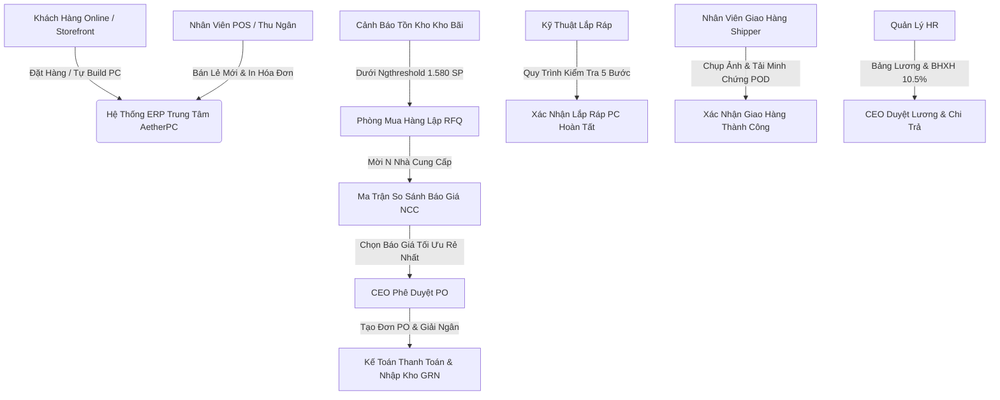

# Xây dựng Hệ thống Quản trị Doanh nghiệp (ERP) Thông Minh Tích hợp Trí tuệ Nhân tạo (AI) trong Quản lý và Lắp ráp Máy tính

> **Dự án Khóa Luận Tốt Nghiệp (KLTN) - Trường Đại Học Công Nghiệp TP. Hồ Chí Minh (IUH)**
> **Tên Đề Tài**: Xây dựng Hệ thống ERP Quản lý Bán lẻ Linh kiện Máy tính kết hợp Website Thương mại Điện tử (AetherPC ERP & Storefront).
> **Đơn vị đào tạo**: Khoa Công nghệ Thông tin - Chuyên ngành Hệ thống Thông tin.

---

## 🌟 Tổng Quan Hệ Thống

**AetherPC ERP** là một hệ thống phần mềm quản trị doanh nghiệp toàn diện (**Enterprise Resource Planning**) được thiết kế tối ưu riêng cho mô hình kinh doanh bán lẻ linh kiện máy tính, phụ kiện công nghệ và máy tính lắp ráp nguyên bộ (Custom Gaming PC / Workstation).

Hệ thống kết nối mượt mà quy trình vận hành **Procure-to-Pay (Mua hàng - Kho bãi - Kế toán)** với **Order-to-Cash (Bán lẻ POS - E-Commerce Storefront - Giao hàng)** và quản trị nguồn nhân lực **Hire-to-Pay (HR & Bảng lương)** trên cùng một nền tảng dữ liệu tập trung.



---

## 💎 Danh Sách Các Phân Hệ & Chức Năng Chính

### 1. Phân Hệ Ban Giám Đốc (CEO Executive Dashboard)
- **Thống kê chỉ số KPI thời gian thực**: Tổng doanh thu, Lợi nhuận gộp ước tính, Đơn hàng mới, Tiền chi trả NCC, Tiến độ xuất kho & lắp ráp.
- **Bộ lọc mốc thời gian động**: Lọc dữ liệu theo *[Hôm nay]*, *[Tuần này]*, *[Tháng này]*, *[Quý này]*.
- **Trung tâm Phê duyệt 3 Cấp (CEO Approval Center)**:
  - Phê duyệt Đơn mua hàng PO vượt hạn mức từ Mua hàng.
  - Phê duyệt Quỹ Bảng Lương Tháng từ Bộ phận HR.
  - Duyệt phiếu nghỉ phép nhân sự.
- **Biểu đồ phân tích kinh doanh**: Biểu đồ đường xu hướng doanh số 7 ngày và biểu đồ tròn cơ cấu kênh bán hàng (Online vs Offline POS).

### 2. Phân Hệ Mua Hàng & So Sánh Báo Giá N NCC (Purchasing & Price Matrix)
- **Ma Trận So Sánh Báo Giá N Nhà Cung Cấp (Price Comparison Matrix)**:
  - Tự động đối sánh đơn giá và tổng chi phí báo giá cho cùng một danh mục linh kiện từ 2+ Nhà cung cấp (Mai Hoàng, Viễn Sơn, Anh Ngọc, ASUS,...).
  - **Thuật toán tự động tính toán tiết kiệm**:
    $$\Delta T = T_{\max} - T_{\min}$$
    $$P_{\text{save}} = \left(\frac{\Delta T}{T_{\max}}\right) \times 100\%$$
  - Tự động gắn nhãn badge **`★ BÁO GIÁ RẺ NHẤT`** màu xanh lá cho phương án tiết kiệm chi phí nhất.
  - **Duyệt tối ưu 1-Click (`handleSelectOptimalSupplier`)**: Tự động chuyển báo giá thắng thầu sang đơn PO và chuyển các báo giá còn lại sang HỦY BỎ.
- **Lập Phiếu Yêu Cầu Báo Giá (RFQ)**: Cho phép thêm linh hoạt N Nhà cung cấp để so giá.

### 3. Phân Hệ Quản Lý Kho & Chiến Lược 1.580 Linh Kiện (Warehouse)
- **Quản lý dữ liệu lớn 1.580 linh kiện PC**: Chiến lược tồn kho 3 cấp độ:
  - **1.000 Sản phẩm An Toàn (SAFE)**: $Stock \ge 15$.
  - **250 Sản phẩm Cảnh Báo (WARNING)**: $1 \le Stock \le 5$.
  - **330 Sản phẩm Hết Hàng (OUT_OF_STOCK)**: $Stock = 0$.
- **Quy trình Nhập Kho (GRN)**: Nhận hàng từ PO, sinh mã Serial Number tự động và tăng số lượng tồn kho tức thì.
- **Nút Hành Động Cảnh Báo**: Tích hợp nút xem nhanh linh kiện hết hàng và tạo ngay RFQ mua bổ sung.

### 4. Phân Hệ Bán Hàng Tại Điểm Bán (Sales POS)
- **Giao diện POS Thu Ngân Siêu Tốc**: Tìm kiếm linh kiện theo tên/SKU, quét mã vạch Barcode.
- **Thanh toán đa kênh**: Tiền mặt, chuyển khoản QR Code ngân hàng tự động.
- **In Hóa Đơn Thanh Toán Paper Thermal**: Xuất hóa đơn giao cho khách hàng tại quầy.

### 5. Phân Hệ Kỹ Thuật Lắp Ráp Máy Tính (Assembly & Work Orders)
- **Quản lý Lệnh Lắp Ráp (Work Orders)**: Tự động khởi tạo lệnh lắp ráp khi có đơn đặt hàng PC Nguyên Bộ.
- **Quy Trình Kiểm Lắp 5 Bước (Checklist)**:
  1. Kiểm tra Socket CPU & Lắp RAM.
  2. Tra keo tản nhiệt & Lắp Tản nhiệt.
  3. Đi dây nguồn & Quản lý cáp gọn gàng.
  4. Cấu hình BIOS & Boot OS.
  5. Chạy Stress Test nạp tải tối đa.

### 6. Phân Hệ Giao Hàng & Vận Chuyển kèm Minh Chứng (Delivery & Proof of Delivery)
- **Điều phối giao hàng**: Theo dõi đơn chờ lấy, đang giao, giao thành công, giao thất bại.
- **Thống kê hiệu suất theo thời gian**: Bộ lọc thống kê *[Hôm nay]*, *[7 ngày qua]*, *[Tháng này]*, *[Tất cả]*.
- **Xác Nhận Đã Giao Kèm Minh Chứng (Proof of Delivery - POD)**:
  - Bắt buộc Shipper tải/chụp ảnh minh chứng giao hàng thực tế.
  - Bắt buộc nhập Tên người nhận thực tế & Ghi chú giao hàng.
  - Tích hợp nút **`📷 Xem Minh Chứng Giao Hàng`** để Ban quản lý tra cứu lại ảnh minh chứng và thời gian giao xong bất kỳ lúc nào.

### 7. Phân Hệ Kế Toán Tài Chính & Báo Cáo P&L (Accounting & Finance)
- **Giải ngân Mua Hàng**: Quản lý và chi trả Vendor Bills cho các PO đã nhập kho.
- **Sổ Nhật Ký Tài Chính (Kế toán VAS)**: Quản lý chứng từ Thu (`INCOME`) & Chi (`EXPENSE`).
- **Báo cáo Kết quả Kinh doanh (P&L)**: Tính toán tổng doanh thu, giá vốn, chi phí vận hành và lợi nhuận ròng.

### 8. Phân Hệ Quản Lý Nhân Sự & Bảng Lương (HR & Payroll)
- **Hồ sơ Nhân viên**: Quản lý hợp đồng, chức danh, lương cơ bản.
- **Tính Bảng Lương Quy Chuẩn**:
  - Khấu trừ **10.5% BHXH/BHYT bắt buộc** (8% BHXH + 1.5% BHYT + 1% BHTN).
  - Thưởng doanh số Sales (1%), thưởng kỹ thuật lắp ráp (150.000đ/máy).
  - Khấu trừ đi trễ và nghỉ không lương.
- **Trình duyệt CEO & Chi trả Kế toán**: Trình CEO duyệt quỹ lương trước khi Kế toán giải ngân.

### 9. Phân Hệ Chăm Sóc Khách Hàng (CSKH & Support Center)
- **Quản lý Yêu cầu Hỗ trợ (Tickets)**: Phân loại ticket theo trạng thái *Mới*, *Đang xử lý*, *Đã giải quyết*.
- **Tra cứu lịch sử bảo hành & tư vấn**: Hỗ trợ giải đáp thắc mắc và xử lý đổi trả cho khách hàng.

### 10. Website Thương Mại Điện Tử & AI Chatbot (Storefront)
- **Каталог 1.580 Linh Kiện PC**: Tìm kiếm siêu tốc, lọc theo giá, thương hiệu, loại linh kiện.
- **Tự Build PC Thông Minh**: Tự động kiểm tra tính tương thích Socket CPU - Mainboard và công suất PSU.
- **Tra cứu vận đơn (`/order-tracking`)**: Khách hàng tự theo dõi hành trình đơn hàng theo mã đơn.
- **Trợ Lý Ảo AI Antigravity Chatbot**: Chatbot AI tư vấn cấu hình PC và kiểm tra kho 24/7.

---

## 🔄 Các Quy Trình Nghiệp Vụ Liên Phân Hệ (End-to-End Workflows)

```text
[QUY TRÌNH 1: PROCURE-TO-PAY (MUA HÀNG - KHO - KẾ TOÁN)]
Thủ Kho báo hết hàng ➔ Nhân viên Mua hàng lập RFQ (Mời 2+ NCC) ➔ Ma trận so giá tự động chọn NCC rẻ nhất ➔ Trình CEO duyệt PO ➔ Kế toán giải ngân tiền hàng ➔ Thủ kho nhận hàng & Nhập kho GRN (Tăng tồn kho)

[QUY TRÌNH 2: ORDER-TO-CASH ONLINE (BÁN HÀNG ONLINE - LẮP RÁP - GIAO HÀNG)]
Khách đặt hàng trên Storefront / Build PC ➔ Sales xác nhận đơn ➔ Kỹ thuật nhận Lệnh Lắp Ráp & tích Checklist 5 bước ➔ Thủ kho xuất hàng cho Shipper ➔ Shipper giao hàng, chụp ảnh Minh chứng POD ➔ Kế toán ghi nhận thu tiền COD

[QUY TRÌNH 3: ORDER-TO-CASH POS (BÁN HÀNG TẠI QUẦY)]
Khách chọn hàng tại Showroom ➔ Thu ngân quét mã vạch Barcode ➔ Khách quét mã QR ngân hàng ➔ In hóa đơn giấy nhiệt ➔ Hệ thống tự động trừ tồn kho

[QUY TRÌNH 4: HIRE-TO-PAY (NHÂN SỰ & BẢNG LƯƠNG)]
HR tổng hợp chấm công ➔ Hệ thống tự tính BHXH 10.5% & Thưởng/Phạt ➔ HR gửi trình Bảng lương cho CEO ➔ CEO phê duyệt ➔ Kế toán giải ngân chi lương ➔ Nhân viên xem Phiếu lương cá nhân
```

---

## 🧪 Hướng Dẫn Kiểm Thử Từng Chức Năng (Step-by-Step Testing Guide)

Dưới đây là các bước kiểm thử chi tiết từng chức năng trên hệ thống (Sử dụng mật khẩu mặc định: `123456`):

### 🔹 Test Case 1: CEO Dashboard & Trung Tâm Phê Duyệt 3 Cấp
1. **Đăng nhập**: Username `ceo` | Mật khẩu `123456`.
2. **Thao tác**:
   - Truy cập **Trang Tổng Quan**.
   - Thử click các nút chọn thời gian: `[Hôm nay]`, `[Tuần này]`, `[Tháng này]`, `[Quý này]`.
   - Quan sát 6 thẻ KPI, biểu đồ đường doanh số 7 ngày và biểu đồ tròn cập nhật dữ liệu tương ứng.
   - Chuyển sang tab **Phê Duyệt Bảng Lương HR** hoặc **Phê Duyệt PO Mua Hàng**: Bấm nút **`✓ Phê Duyệt`**.
3. **Kỳ vọng**: Hệ thống cập nhật trạng thái phê duyệt và gửi thông báo thành công.

---

### 🔹 Test Case 2: So Sánh Báo Giá N Nhà Cung Cấp & Chọn Báo Giá Rẻ Nhất
1. **Đăng nhập**: Username `purchasing` | Mật khẩu `123456`.
2. **Thao tác**:
   - Truy cập **Quản Lý Mua Hàng** $\rightarrow$ Chọn tab **So Sánh Báo Giá NCC**.
   - Quan sát Ma trận so giá giữa các NCC (ví dụ: *Mai Hoàng* vs *Viễn Sơn*).
   - Kiểm tra nhãn **`★ BÁO GIÁ RẺ NHẤT`** và tỷ lệ tiết kiệm $\%(P_{\text{save}})$.
   - Bấm nút **`Duyệt Báo Giá Rẻ Nhất`**.
3. **Kỳ vọng**: Báo giá tối ưu chuyển thành Đơn PO chính thức, các báo giá thua thầu tự động chuyển thành `CANCELLED`.

---

### 🔹 Test Case 3: Bán Hàng Tại Quầy POS & In Hóa Đơn
1. **Đăng nhập**: Username `sales` | Mật khẩu `123456`.
2. **Thao tác**:
   - Truy cập **Quản Lý Bán Hàng (POS)**.
   - Tìm kiếm sản phẩm hoặc quét mã Barcode linh kiện (ví dụ: *ASUS RTX 4070*).
   - Nhập thông tin khách hàng, chọn hình thức thanh toán *Chuyển khoản QR* hoặc *Tiền mặt*.
   - Bấm **`Thanh Toán & In Hóa Đơn`**.
3. **Kỳ vọng**: Đơn hàng tạo thành công, popup hóa đơn in nhiệt hiển thị chuẩn đẹp, tồn kho sản phẩm tự động giảm.

---

### 🔹 Test Case 4: Nhập Kho GRN & Quản Lý 1.580 Linh Kiện
1. **Đăng nhập**: Username `warehouse` | Mật khẩu `123456`.
2. **Thao tác**:
   - Truy cập **Quản Lý Kho**.
   - Kiểm tra danh sách 1.580 linh kiện PC (Lọc theo *An Toàn*, *Cảnh Báo*, *Hết Hàng*).
   - Chọn một đơn PO chờ nhập kho $\rightarrow$ Bấm **`Nhập Kho GRN`**.
3. **Kỳ vọng**: Số lượng tồn kho sản phẩm tăng lên tương ứng, hệ thống ghi nhận mã Serial Number nhập kho.

---

### 🔹 Test Case 5: Quy Trình Lắp Ráp PC Theo Checklist 5 Bước
1. **Đăng nhập**: Username `assembly` | Mật khẩu `123456`.
2. **Thao tác**:
   - Truy cập **Quản Lý Lắp Ráp**.
   - Chọn một Lệnh lắp ráp (Work Order) đang chờ.
   - Tích chọn đủ 5 bước Checklist: *Socket CPU*, *Tra keo tản nhiệt*, *Đi dây cáp*, *Cấu hình BIOS*, *Stress Test*.
   - Bấm **`Hoàn Thành Lắp Ráp`**.
3. **Kỳ vọng**: Lệnh lắp ráp chuyển sang `COMPLETED`, đơn hàng sẵn sàng bàn giao cho Shipper.

---

### 🔹 Test Case 6: Shipper Giao Hàng & Tải Minh Chứng POD (Proof of Delivery)
1. **Đăng nhập**: Username `delivery` | Mật khẩu `123456`.
2. **Thao tác**:
   - Truy cập **Quản Lý Giao Hàng** $\rightarrow$ Tab **Đang giao**.
   - Chọn đơn hàng $\rightarrow$ Bấm **`✓ Xác Nhận Đã Giao`**.
   - Tại Pop-up: Tải/chụp ảnh minh chứng giao hàng thực tế, nhập Tên người nhận thực tế.
   - Bấm **`✓ Xác Nhận Giao Thành Công`**.
   - Tại tab **Đã giao**: Bấm nút **`📷 Xem Minh Chứng Giao Hàng`** để kiểm tra lại.
3. **Kỳ vọng**: Đơn hàng lưu thành công ảnh minh chứng, thời gian giao và tên người nhận.

---

### 🔹 Test Case 7: Lập Bảng Lương HR, Tính BHXH 10.5% & Trình CEO
1. **Đăng nhập**: Username `hr` | Mật khẩu `123456`.
2. **Thao tác**:
   - Truy cập **Quản Lý Nhân Sự** $\rightarrow$ Chọn tab **Bảng Lương**.
   - Kiểm tra cột Khấu trừ **BHXH 10.5%**, thưởng doanh số và phạt đi trễ.
   - Bấm **`Gửi Trình CEO Phê Duyệt Bảng Lương`**.
3. **Kỳ vọng**: Trạng thái bảng lương chuyển thành `SUBMITTED_TO_CEO`, CEO nhận được thông báo phê duyệt.

---

### 🔹 Test Case 8: Kế Toán Giải Ngân, Sổ Cái VAS & Báo Cáo P&L
1. **Đăng nhập**: Username `accounting` | Mật khẩu `123456`.
2. **Thao tác**:
   - Truy cập **Kế Toán Tài Chính**.
   - Chọn tab **Hóa Đơn Mua Hàng (Vendor Bills)** $\rightarrow$ Bấm **`Thanh Toán PO`**.
   - Chuyển sang tab **Báo Cáo P&L**: Kiểm tra Tổng doanh thu, Giá vốn hàng bán và Lợi nhuận gộp.
3. **Kỳ vọng**: Sổ cái ghi nhận chứng từ Chi (`EXPENSE`), báo cáo P&L cập nhật thời gian thực.

---

### 🔹 Test Case 9: Website Storefront, Tự Build PC & Tra Cứu Vận Đơn
1. **Thao tác**:
   - Truy cập Trang chủ `http://localhost:3000`.
   - Vào mục **Tự Build PC**: Thử chọn CPU Intel LGA1700 và Mainboard AMD AM5 $\rightarrow$ Kiểm tra cảnh báo không tương thích Socket.
   - Thử đặt một đơn hàng Online.
   - Truy cập `/order-tracking` $\rightarrow$ Nhập mã đơn hàng vừa đặt để kiểm tra hành trình.
2. **Kỳ vọng**: Tính năng tương thích PC hoạt động chính xác, tra cứu vận đơn hiển thị rõ lộ trình.

---

## 🔑 Danh Sách 14 Tài Khoản Demo Phân Quyền ERP

| STT | Mã Vai Trò (Role) | Chức Danh Phân Nhiệm | Username | Mật khẩu mẫu |
| :---: | :--- | :--- | :--- | :--- |
| 1 | **`CEO`** | Giám Đốc Điều Hành (CEO) | `ceo` | `123456` |
| 2 | **`ADMIN`** | Quản Trị Hệ Thống (System Admin) | `admin` | `123456` |
| 3 | **`SALES_MANAGER`** | Quản Lý Bán Hàng | `sales_manager` | `123456` |
| 4 | **`SALES`** | Bán Hàng / Thu Ngân POS | `sales` | `123456` |
| 5 | **`WAREHOUSE_MANAGER`** | Quản Lý Kho Bãi | `warehouse_manager` | `123456` |
| 6 | **`WAREHOUSE`** | Thủ Kho / Nhân Viên Kho | `warehouse` | `123456` |
| 7 | **`PURCHASING`** | Nhân Viên Mua Hàng | `purchasing` | `123456` |
| 8 | **`SUPPLIER`** | Nhà Cung Cấp Đối Tác | `supplier` | `123456` |
| 9 | **`ASSEMBLY`** | Kỹ Thuật Lắp Ráp PC | `assembly` | `123456` |
| 10 | **`HR`** | Quản Lý Nhân Sự | `hr` | `123456` |
| 11 | **`ACCOUNTANT`** | Kế Toán Tài Chính | `accounting` | `123456` |
| 12 | **`CSKH`** | Chăm Sóc Khách Hàng | `cskh` | `123456` |
| 13 | **`DELIVERY`** | Nhân Viên Giao Hàng | `delivery` | `123456` |
| 14 | **`CUSTOMER_B2B`** | Khách Hàng Doanh Nghiệp | `customer_b2b` | `123456` |

---

## 🛠️ Hướng Dẫn Khởi Chạy Nhanh (Local Development)

### 1. Khởi chạy Backend API
```bash
cd backend
npm install
npx prisma generate
npx prisma db push
npm run db:seed
npm run dev
```

### 2. Khởi chạy Frontend React
```bash
cd ../frontend
npm install
npm run dev
```
*Ứng dụng sẽ chạy tại: `http://localhost:3000`.*

---

## 📄 File Báo Cáo Khóa Luận Tốt Nghiệp Chuẩn IUH (.docx)

Báo cáo Khóa luận Tốt nghiệp hoàn chỉnh theo chuẩn **Trường Đại Học Công Nghiệp TP. Hồ Chí Minh (IUH)** đã được lưu trữ tại:
👉 **[Bao_Cao_Khoa_Luan_Tot_Nghiep_IUH_AetherPC_ERP.docx](file:///c:/Users/nguye/OneDrive/Desktop/KLTN/Bao_Cao_Khoa_Luan_Tot_Nghiep_IUH_AetherPC_ERP.docx)**

---

## 📝 Bản Quyền
Dự án được hoàn thiện phục vụ Khóa luận Tốt nghiệp Đại học chuyên ngành Hệ thống Thông tin - Khoa CNTT - Trường Đại học Công nghiệp TP. Hồ Chí Minh (IUH). All rights reserved © 2026.
