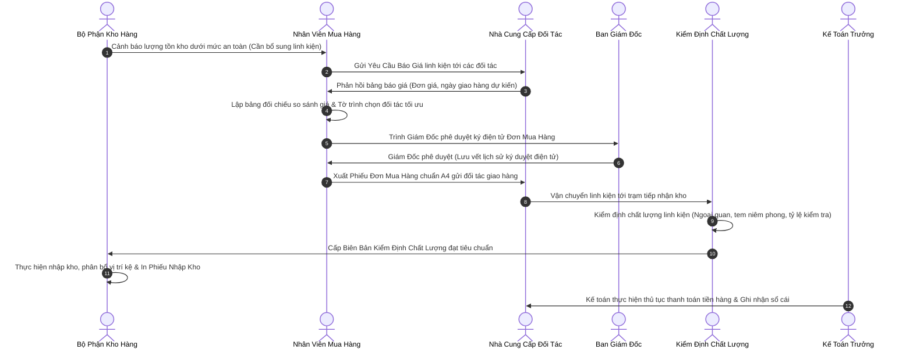
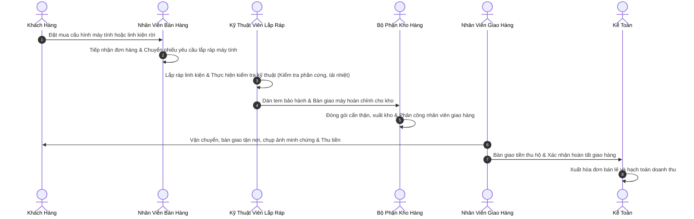

# BÁO CÁO HỆ THỐNG QUẢN LÝ DOANH NGHIỆP TỔNG THỂ (ERP)
## NGÀNH HÀNG: BÁN LẺ, PHÂN PHỐI VÀ LẮP RÁP LINH KIỆN MÁY TÍNH CHÍNH HÃNG

> **Đề Tài Khóa Luận Tốt Nghiệp Đại Học**  
> **Trường**: Đại Học Công Nghiệp Thành Phố Hồ Chí Minh (IUH)  
> **Khoa**: Công Nghệ Thông Tin — **Chuyên Ngành**: Hệ Thống Thông Tin  
> **Đề Tài**: Xây dựng và triển khai hệ thống quản lý doanh nghiệp (ERP) tích hợp cổng thương mại điện tử cho doanh nghiệp kinh doanh linh kiện máy tính.

---

## MỤC LỤC TÀI LIỆU

1. [1. Giới Thiệu Đề Tài & Bối Cảnh Nghiệp Vụ](#1-giới-thiệu-đề-tài--bối-cảnh-nghiệp-vụ)
2. [2. Kiến Trúc Tổng Thể Hệ Thống](#2-kiến-trúc-tổng-thể-hệ-thống)
3. [3. Sơ Đồ Quy Trình Nghiệp Vụ Trọng Tâm](#3-sơ-đồ-quy-trình-nghiệp-vụ-trọng-tâm)
4. [4. Ma Trận Phân Quyền Người Dùng & Chuyển Đổi Vai Trò](#4-ma-trận-phân-quyền-người-dùng--chuyển-đổi-vai-trò)
5. [5. Mô Tả Chi Tiết Các Phân Hệ Quản Trị Nghiệp Vụ](#5-mô-tả-chi-tiết-các-phân-hệ-quản-trị-nghiệp-vụ)
6. [6. Cổng Mua Sắm Trực Tuyến & Công Cụ Tự Xây Dựng Cấu Hình](#6-cổng-mua-sắm-trực-tuyến--công-cụ-tự-xây-dựng-cấu-hình)
7. [7. Danh Bạ Các Nhà Cung Cấp Đối Tác Chính Hãng](#7-danh-bạ-các-nhà-cung-cấp-đối-tác-chính-hãng)
8. [8. Danh Sách Tài Khoản Thử Nghiệm Hệ Thống](#8-danh-sách-tài-khoản-thử-nghiệm-hệ-thống)
9. [9. Danh Mục Giao Diện Lập Trình Ứng Dụng (API)](#9-danh-mục-giao-diện-lập-trình-ứng-dụng-api)
10. [10. Công Nghệ & Nền Tảng Kỹ Thuật Sử Dụng](#10-công-nghệ--nền-tảng-kỹ-thuật-sử-dụng)
11. [11. Hướng Dẫn Cài Đặt Và Vận Hành Hệ Thống](#11-hướng-dẫn-cài-đặt-và-vận-hành-hệ-thống)

---

## 1. Giới Thiệu Đề Tài & Bối Cảnh Nghiệp Vụ

Hoạt động kinh doanh bán lẻ linh kiện máy tính và dịch vụ lắp ráp máy tính theo yêu cầu tại thị trường Việt Nam mang tính đặc thù cao, đòi hỏi hệ thống quản lý phải xử lý dữ liệu phức tạp:
* **Đặc tả kỹ thuật phần cứng ràng buộc nghiêm ngặt**: Khả năng tương thích giữa chân cắm vi xử lý (Socket CPU), chuẩn bộ nhớ RAM, kích thước bo mạch chủ và công suất nguồn điện.
* **Quản lý đa nhà cung cấp**: Khảo sát và đối chiếu đơn giá từ nhiều đối tác phân phối chính hãng (*Intel, AMD, ASUS, Gigabyte, MSI, Viễn Sơn, Anh Ngọc, Corsair, Kingston, Samsung, LG...*) để chọn nguồn hàng có chi phí tối ưu.
* **Kiểm soát chất lượng đầu vào (IQC)**: Kiểm tra tình trạng nguyên seal, bao bì, ngoại quan và thông số trước khi đưa hàng vào kho lưu trữ.
* **Quy trình ký duyệt nhiều cấp**: Giám Đốc phê duyệt điện tử đơn mua hàng trước khi xuất phiếu đặt hàng chính thức khổ A4 gửi sang đối tác.

Hệ thống ERP này được thiết kế để giải quyết trọn vẹn chuỗi cung ứng khép kín, kết nối đồng bộ giữa các bộ phận: Bán hàng, Mua hàng, Kho bãi, Kiểm định chất lượng, Lắp ráp kỹ thuật, Kế toán tài chính, Giao nhận và Ban Giám Đốc.

---

## 2. Kiến Trúc Tổng Thể Hệ Thống

```
+----------------------------------------------------------------------------------------+
|                                TẦNG GIAO DIỆN NGƯỜI DÙNG                               |
|  +------------------------+  +------------------------+  +--------------------------+  |
|  |  Cổng Mua Sắm Bán Lẻ   |  |  Trung Tâm Quản Trị    |  |  Cổng Tác Nghiệp Đối Tác |  |
|  |  - Chọn linh kiện PC   |  |  - 12 Phân hệ quản lý  |  |  - Báo giá & Xác nhận    |  |
|  |  - Đặt hàng trực tuyến |  |  - Báo cáo chỉ số KPI  |  |    giao hàng trực tiếp    |  |
|  +-----------+------------+  +-----------+------------+  +------------+-------------+  |
+--------------|---------------------------|----------------------------|----------------+
               | Giao thức mạng HTTP       | Kết nối Thời gian thực     | Mã khóa bảo mật
+--------------v---------------------------v----------------------------v----------------+
|                        TẦNG DỊCH VỤ & XỬ LÝ NGHIỆP VỤ TRUNG TÂM                        |
|  +----------------------------------------------------------------------------------+  |
|  | Cổng điều phối API (Xác thực người dùng, Phân quyền vai trò, Bảo mật an toàn)   |  |
|  +-----------------+------------------+------------------+--------------------------+  |
|  | Nghiệp Vụ Mua   | Quản Lý Kho Bãi  | Nghiệp Vụ Bán    | Kế Toán & Tài Chính      |  |
|  | - Khảo sát giá  | - Vị trí kệ kho  | - Bán tại quầy   | - Hạch toán sổ thu/chi   |  |
|  | - Duyệt đơn PO  | - Phiếu nhập/xuất| - Quản lý đơn    | - Tính lương & Bảo hiểm  |  |
|  +-----------------+------------------+------------------+--------------------------+  |
|  | Kênh hỗ trợ khách hàng trực tuyến (Phản hồi tức thì, lưu trữ nhật ký hội thoại)   |  |
|  | Trợ lý hỗ trợ tư vấn cấu hình máy tính tự động                                    |  |
|  +----------------------------------------------------------------------------------+  |
+------------------------------------------+---------------------------------------------+
                                           | Trình điều khiển kết nối CSDL
+------------------------------------------v---------------------------------------------+
|                               TẦNG CƠ SỞ DỮ LIỆU & LƯU TRỮ                             |
|  +-------------------------------------------+  +-----------------------------------+  |
|  | Cơ Sở Dữ Liệu Quan Hệ PostgreSQL 15       |  | Phân Vùng Lưu Trữ Dữ Liệu Bền     |  |
|  | - Quản lý danh mục hàng hóa, đơn hàng     |  | - Lưu trữ chứng từ, hóa đơn &     |  |
|  |   lô kho, nhân sự và lịch sử phê duyệt    |    nhật ký thao tác hệ thống         |  |
|  +-------------------------------------------+  +-----------------------------------+  |
+----------------------------------------------------------------------------------------+
```

---

## 3. Sơ Đồ Quy Trình Nghiệp Vụ Trọng Tâm

### 3.1. Quy Trình Mua Hàng & Cung Ứng Vật Tư



### 3.2. Quy Trình Bán Hàng, Lắp Ráp & Giao Nhận



---

## 4. Ma Trận Phân Quyền Người Dùng & Chuyển Đổi Vai Trò

Hệ thống phân định quyền hạn rõ ràng theo từng phòng ban chức năng, đồng thời cung cấp menu **Chuyển đổi vai trò quản lý** giúp Quản trị viên dễ dàng thao tác kiểm thử:

| Mã Định Danh | Tên Vai Trò Chức Năng | Phạm Vi Quyền Hạn Trọng Tâm | Quyền Phê Duyệt Cấp Cao |
| :--- | :--- | :--- | :---: |
| `ADMIN` | **Quản Trị Hệ Thống** | Quản lý tài khoản, cấu hình phân quyền, danh bạ nhà cung cấp, nhật ký thao tác | **Toàn Quyền** |
| `CEO` | **Ban Giám Đốc** | Xem bảng chỉ số điều hành, phê duyệt đơn mua hàng, xem lịch sử ký duyệt | **Duyệt Chi & Đơn Hàng** |
| `SALES_MANAGER` | **Quản Lý Bán Hàng** | Điều hành hoạt động kinh doanh, xét duyệt chiết khấu đặc biệt, báo cáo doanh thu | **Duyệt Giảm Giá** |
| `SALES` | **Nhân Viên Bán Hàng** | Bán hàng tại quầy POS, tra cứu thông tin khách hàng, tư vấn cấu hình linh kiện | *Không* |
| `WAREHOUSE_MANAGER`| **Quản Lý Kho** | Điều phối xuất nhập vật tư, tổ chức kiểm kê định kỳ, sắp xếp sơ đồ kệ kho | **Duyệt Xuất/Nhập Kho** |
| `WAREHOUSE` | **Thủ Kho** | Tạo yêu cầu mua hàng khi hết tồn kho, lập phiếu nhập kho, phân công giao nhận | *Không* |
| `PURCHASING` | **Nhân Viên Mua Hàng** | Lập yêu cầu báo giá, đối chiếu đơn giá các bên, in phiếu đơn mua hàng chuẩn A4 | *Không* |
| `QC` | **Kiểm Định Chất Lượng**| Thẩm định chất lượng lô hàng nhập kho, lập biên bản tiếp nhận hoặc từ chối hàng | **Ký Biên Bản Kiểm Định** |
| `ASSEMBLY` | **Kỹ Thuật Lắp Ráp** | Tiếp nhận phiếu lắp ráp máy tính, kiểm thử độ ổn định và bàn giao máy | *Không* |
| `HR` | **Quản Lý Nhân Sự** | Quản lý hồ sơ nhân viên, bảng chấm công 26 ngày, tính lương và trích nộp bảo hiểm | **Duyệt Bảng Lương** |
| `ACCOUNTANT` | **Kế Toán Trưởng** | Sổ sách thu chi, thanh toán công nợ nhà cung cấp, xuất hóa đơn VAT | **Duyệt Giải Ngân** |
| `CSKH` | **Chăm Sóc Khách Hàng** | Kênh trao đổi trực tiếp với khách hàng, xử lý yêu cầu hỗ trợ kỹ thuật | *Không* |
| `DELIVERY` | **Nhân Viên Giao Hàng** | Nhận danh sách đơn cần giao, cập nhật tiến độ vận chuyển, gửi ảnh minh chứng giao | *Không* |
| `SUPPLIER` | **Nhà Cung Cấp Đối Tác** | Nhận yêu cầu báo giá, gửi báo giá linh kiện và xác nhận ngày giao hàng | *Không* |

---

## 5. Mô Tả Chi Tiết Các Phân Hệ Quản Trị Nghiệp Vụ

### 5.1. Phân Hệ Ban Giám Đốc
* **Bảng chỉ số điều hành**: Doanh thu bán hàng, tỷ trọng mặt hàng bán chạy, tiến độ đơn hàng và cảnh báo tồn kho.
* **Khu vực phê duyệt đơn mua hàng**: Xem tờ trình so sánh giá giữa các nhà cung cấp và mức chi phí tiết kiệm được.
* **Lịch sử phê duyệt ký điện tử**: Lưu vết toàn bộ chứng từ có chữ ký và mộc đỏ điện tử của Giám Đốc.
* **Xem chi tiết tiến trình**: Theo dõi 5 bước vòng đời đơn hàng và mở xem phiếu in ấn trực tiếp.

### 5.2. Phân Hệ Mua Hàng & Cung Ứng
* **Quản lý yêu cầu báo giá**: Lập danh sách sản phẩm cần nhập, tự động lấy số lượng đề xuất từ kho hàng.
* **Quản lý đơn mua hàng**: Theo dõi trạng thái đơn hàng mua từ đối tác.
* **In phiếu đơn mua hàng chuẩn A4 thuần Việt**:
  * Định dạng vừa vặn trên **1 trang A4 duy nhất** không tràn trang.
  * Văn phong hành chính tiếng Việt: *Bên Mua (Bên A)*, *Bên Bán (Bên B)*, *Mã số thuế*, *Đại diện phòng mua hàng*, *Người phê duyệt*.
  * In độc lập thông qua khung in riêng biệt, chất lượng sắc nét.
* **Quản lý danh bạ đối tác**: Phân quyền hiển thị danh sách cho nhân viên mua hàng và nút **Thêm Nhà Cung Cấp Mới** cho Quản trị viên.

### 5.3. Phân Hệ Quản Lý Kho Bãi
* **Sơ đồ bố trí kệ kho**: Định vị hàng hóa theo tầng, dãy và ô kệ, tối ưu thời gian tìm kiếm linh kiện.
* **Phiếu nhập kho & xuất kho**: Lập phiếu nhập kho sau khi đạt chuẩn kiểm định chất lượng, cập nhật số lượng tồn kho tức thì.
* **Phân công giao hàng**: Lựa chọn nhân viên giao nhận cụ thể khi xuất kho các đơn hàng giao tận nơi.

### 5.4. Phân Hệ Kiểm Định Chất Lượng
* **Tiếp nhận lô hàng**: Kiểm tra lô hàng từ nhà cung cấp theo các tỷ lệ lấy mẫu quy định (100%, 50%, 10%).
* **Biên bản đánh giá**: Ghi nhận kết quả kiểm tra ngoại quan, phụ kiện đi kèm, phân loại hàng đạt chuẩn hoặc lập biên bản từ chối.

### 5.5. Phân Hệ Kỹ Thuật & Lắp Ráp Máy Tính
* **Quy trình 5 bước kỹ thuật**: Kiểm tra tính tương thích linh kiện -> Tiến hành lắp đặt -> Đi dây nguồn và tản nhiệt -> Cài đặt phần mềm -> Chạy thử nghiệm chịu tải.
* **Bàn giao và niêm phong**: Dán tem bảo hành và lập phiếu bàn giao thiết bị hoàn chỉnh cho bộ phận kho.

### 5.6. Phân Hệ Bán Hàng Tại Quầy (POS)
* **Giao diện bán hàng nhanh**: Tìm kiếm linh kiện nhanh, quét mã vạch, áp dụng mã ưu đãi, hỗ trợ thanh toán tiền mặt, chuyển khoản ngân hàng và quẹt thẻ.
* **In hóa đơn tức thì**: Xuất phiếu tính tiền khổ nhỏ cho khách hàng tại quầy.

### 5.7. Phân Hệ Kế Toán & Tài Chính
* **Sổ nhật ký thu chi**: Ghi nhận tự động các khoản thu từ khách hàng, chi trả tiền hàng cho đối tác và chi phí vận hành.
* **Quản lý hóa đơn thuế giá trị gia tăng**: Lưu trữ thông tin xuất hóa đơn tài chính theo quy định hiện hành.

### 5.8. Phân Hệ Quản Trị Nhân Sự & Tiền Lương
* **Bảng chấm công 26 ngày**: Ghi nhận số ngày công thực tế, tính lương cơ bản, tính thưởng doanh số bán hàng và thưởng công lắp ráp.
* **Trích nộp bảo hiểm bắt buộc**: Tự động tính tỷ lệ trích 10.5% vào lương (BHXH, BHYT, BHTN) theo quy chuẩn Luật Lao Động.

### 5.9. Phân Hệ Giao Nhận & Vận Chuyển
* **Danh sách đơn giao hàng**: Hiển thị địa chỉ, thông tin người nhận và số điện thoại liên hệ của từng chuyến giao.
* **Minh chứng giao hàng**: Chụp và gửi ảnh minh chứng giao hàng thành công, tự động cập nhật trạng thái đơn và tiền thu hộ.

### 5.10. Phân Hệ Chăm Sóc Khách Hàng
* **Trao đổi trực tuyến hai chiều**: Kết nối tức thì giữa chuyên viên tư vấn và khách hàng truy cập website.
* **Hộp công cụ hỗ trợ**: Mẫu câu giải đáp nhanh, xem lịch sử mua sắm và chuyển tuyến hỗ trợ kỹ thuật.

### 5.11. Phân Hệ Quản Trị Hệ Thống
* **Quản lý danh sách tài khoản**: Thêm mới nhân viên, đặt lại mật khẩu về mặc định và nút chuyển đổi vai trò trực tiếp.
* **Bảng phân quyền vai trò**: Điều chỉnh quyền Xem, Tạo, Sửa, Duyệt cho từng nhóm người dùng.
* **Đối tác & Nhà cung cấp**: Quản lý thông tin pháp lý, mã số thuế, địa chỉ và số điện thoại các nhà phân phối linh kiện.
* **Nhật ký kiểm toán an ninh**: Ghi lại lịch sử các thao tác đăng nhập, thay đổi thông tin và cập nhật trạng thái dữ liệu.

---

## 6. Cổng Mua Sắm Trực Tuyến & Công Cụ Tự Xây Dựng Cấu Hình

* **Công cụ tự xây dựng cấu hình máy tính**:
  * Tự động lọc linh kiện tương thích: Chân cắm vi xử lý, chuẩn chân cắm bo mạch, loại bộ nhớ RAM và công suất nguồn đáp ứng.
  * Lưu bản in cấu hình hoặc đưa toàn bộ cấu hình vào giỏ hàng mua sắm.
* **Chính sách khách hàng thân thiết**: Phân hạng mức thành viên (Đồng, Bạc, Vàng, Kim Cương) theo tích lũy chi tiêu và áp dụng mức ưu đãi tự động.
* **Trợ lý tư vấn tự động**: Hỗ trợ giải đáp thông số kỹ thuật và gợi ý cấu hình phù hợp với ngân sách và nhu cầu sử dụng của khách hàng.

---

## 7. Danh Bạ Các Nhà Cung Cấp Đối Tác Chính Hãng

| Mã Đối Tác | Tên Doanh Nghiệp Đối Tác | Mã Số Thuế | Danh Mục Phân Phối Chính |
| :--- | :--- | :---: | :--- |
| `SUP-INTEL-VN` | **Intel Technology Vietnam Co., Ltd** | 0304556677 | Vi xử lý CPU Intel Core thế hệ 12, 13, 14 |
| `SUP-AMD-VN` | **AMD Southeast Asia Pte Ltd (Văn phòng đại diện)** | 0317896542 | Vi xử lý CPU AMD Ryzen và Card đồ họa Radeon |
| `SUP-ASUS-VN` | **ASUS Vietnam Co., Ltd** | 0309988776 | Bo mạch chủ, Card màn hình, Màn hình máy tính |
| `SUP-GIGABYTE-VN` | **Công ty TNHH Gigabyte Việt Nam** | 0312665544 | Bo mạch chủ, Card đồ họa Gigabyte và Aorus |
| `SUP-MSI-VN` | **MSI Vietnam Technology Co., Ltd** | 0316554433 | Bo mạch chủ và Card đồ họa MSI chuyên dụng |
| `SUP-VIENSON` | **Công ty Cổ phần Máy tính Viễn Sơn** | 0301889977 | Nhà phân phối Gigabyte, Kingston, Corsair |
| `SUP-ANHNGOC` | **Công ty CP Đầu tư Công nghệ Anh Ngọc**| 0102778899 | Nhà phân phối MSI, DeepCool, TeamGroup |
| `SUP-CORSAIR-VN` | **Corsair Vietnam Office** | 0315443322 | Bộ nhớ RAM Corsair, Nguồn máy tính, Tản nhiệt |
| `SUP-KINGSTON-VN`| **Kingston Technology Far East Corp** | 0314221100 | Bộ nhớ RAM Kingston Fury, Ổ cứng thể rắn SSD |
| `SUP-SAMSUNG-VN` | **Samsung Electronics HCMC CE Complex** | 0312998811 | Ổ cứng SSD Samsung, Màn hình đồ họa cao cấp |
| `SUP-LG-VN` | **LG Electronics Vietnam Haiphong** | 0201334455 | Màn hình máy tính chuyên dụng LG UltraGear |
| `SUP-WESTERN-VN` | **Western Digital Vietnam** | 0311776655 | Ổ cứng lưu trữ HDD và SSD Western Digital |
| `SUP-SEAGATE-VN` | **Seagate Technology Vietnam** | 0313887766 | Ổ cứng lưu trữ dung lượng lớn Seagate |
| `SUP-COOLERMASTER`| **Cooler Master Vietnam** | 0314998877 | Vỏ thùng máy tính, Bộ nguồn máy tính, Tản nhiệt nước |
| `SUP-THERMALTAKE` | **Thermaltake Technology VN** | 0315667788 | Vỏ máy tính kính cường lực, Nguồn máy tính |
| `SUP-DEEPCOOL-VN` | **DeepCool Technology Co., Ltd** | 0316889900 | Bộ tản nhiệt khí và Tản nhiệt nước máy tính |

---

## 8. Danh Sách Tài Khoản Thử Nghiệm Hệ Thống

Tất cả tài khoản hệ thống dùng chung mật khẩu mặc định: `123456`

| Vai Trò Phụ Trách | Tên Đăng Nhập | Mật Khẩu | Họ Và Tên Nhân Sự | Đường Dẫn Phân Hệ |
| :--- | :---: | :---: | :--- | :--- |
| **Quản Trị Hệ Thống** | `admin` | `123456` | Quản Trị Viên Hệ Thống | `/admin/system?tab=overview` |
| **Ban Giám Đốc** | `ceo` | `123456` | Nguyễn Văn A (Tổng Giám Đốc) | `/admin/dashboard` |
| **Quản Lý & Bán Hàng** | `sales` | `123456` | Trần Thị B (Nhân Viên Bán Hàng) | `/admin/sales` |
| **Quản Lý & Kho Vận** | `warehouse` | `123456` | Lê Văn C (Thủ Kho Quản Lý) | `/admin/warehouse` |
| **Phòng Mua Hàng** | `purchasing` | `123456` | Phạm Thu Mua (Phòng Mua Hàng) | `/admin/purchasing` |
| **Kiểm Định Chất Lượng**| `qc` | `123456` | Nguyễn Văn QC (Chuyên Viên Kiểm Định) | `/admin/quality-control` |
| **Kỹ Thuật Lắp Ráp** | `assembly` | `123456` | Phạm Văn D (Kỹ Thuật Viên Phần Cứng) | `/admin/assembly` |
| **Quản Trị Nhân Sự** | `hr` | `123456` | Nguyễn Nhân Sự (Trưởng Phòng Nhân Sự) | `/admin/hr` |
| **Kế Toán Tài Chính** | `accounting` | `123456` | Trần Kế Toán (Kế Toán Trưởng) | `/admin/accounting` |
| **Chăm Sóc Khách Hàng**| `cskh` | `123456` | Nguyễn CSKH (Chuyên Viên Tư Vấn) | `/admin/cskh` |
| **Giao Vận (Giao Hàng)**| `delivery` | `123456` | Nguyễn Văn A (Nhân Viên Giao Hàng) | `/admin/delivery` |
| **Khách Hàng Mua Sắm** | `customer` | `123456` | Nguyễn Khách Hàng (Tài Khoản Mua Sắm) | `/profile` |
| **Nhà Cung Cấp Đối Tác**| `supplier` | `123456` | Nhà Cung Cấp Đối Tác (Cổng B2B) | `/supplier/portal` |

---

## 9. Danh Mục Giao Diện Lập Trình Ứng Dụng (API)

### 9.1. Nhóm Xác Thực Người Dùng (`/api/v1/auth`)
* `POST /api/v1/auth/login`: Xác thực thông tin đăng nhập và cấp mã phiên làm việc.
* `POST /api/v1/auth/register`: Đăng ký tài khoản khách hàng mới.
* `GET /api/v1/auth/me`: Kiểm tra thông tin người dùng hiện hành từ phiên làm việc.

### 9.2. Nhóm Nghiệp Vụ Mua Hàng (`/api/v1/purchasing`)
* `GET /api/v1/purchasing/orders`: Lấy danh sách Yêu cầu báo giá và Đơn mua hàng.
* `POST /api/v1/purchasing/orders`: Khởi tạo yêu cầu báo giá hoặc đơn đặt hàng mới.
* `PATCH /api/v1/purchasing/orders/:id/status`: Cập nhật trạng thái đơn (Giám Đốc phê duyệt, Hủy đơn, Nhập kho...).
* `GET /api/v1/purchasing/suppliers`: Tra cứu danh bạ các đối tác nhà cung cấp.
* `POST /api/v1/purchasing/suppliers`: Quản trị viên lưu thông tin nhà cung cấp mới vào cơ sở dữ liệu.

### 9.3. Nhóm Quản Lý Kho Bãi (`/api/v1/warehouse`)
* `GET /api/v1/warehouse/inventory`: Tra cứu số lượng tồn kho và vị trí kệ hàng.
* `POST /api/v1/warehouse/receipts`: Khởi tạo phiếu nhập kho sau khi kiểm định chất lượng đạt yêu cầu.
* `POST /api/v1/warehouse/dispatch`: Thực hiện xuất kho và chỉ định nhân viên giao nhận.

### 9.4. Nhóm Quản Lý Bán Hàng & Đơn Đặt Hàng (`/api/v1/orders`)
* `GET /api/v1/orders`: Tra cứu danh sách đơn mua của khách hàng.
* `POST /api/v1/orders`: Tiếp nhận đơn mua từ website hoặc hóa đơn bán hàng tại quầy.
* `PATCH /api/v1/orders/:id/status`: Chuyển đổi trạng thái xử lý đơn hàng theo từng công đoạn.

### 9.5. Nhóm Giao Vận & Vận Chuyển (`/api/v1/delivery`)
* `GET /api/v1/delivery/tasks`: Danh sách các đơn hàng được giao cho từng nhân viên giao nhận.
* `POST /api/v1/delivery/proof`: Gửi dữ liệu ảnh minh chứng hoàn tất giao hàng và ghi nhận tiền thu hộ.

---

## 10. Công Nghệ & Nền Tảng Kỹ Thuật Sử Dụng

* **Giao Diện Phía Người Dùng**:
  * **React 18 & Vite**: Thư viện xây dựng giao diện người dùng hiện đại, tốc độ phản hồi trang mượt mà.
  * **Chart.js**: Thư viện vẽ biểu đồ phân tích số liệu thống kê trực quan.
  * **Bộ Biểu Tượng Giao Diện Lucide**: Hệ thống biểu tượng thống nhất, rõ ràng.
  * **Hệ Thống Phong Cách Giao Diện Thuần CSS**: Tối ưu hiển thị in ấn khổ giấy A4 chuẩn mực, không phụ thuộc thư viện định dạng ngoài.
* **Hệ Thống Máy Chủ Nghiệp Vụ**:
  * **Node.js & Express.js**: Nền tảng xây dựng máy chủ xử lý dữ liệu trung tâm ổn định.
  * **Prisma**: Công cụ ánh xạ đối tượng cơ sở dữ liệu (ORM) an toàn và chuẩn xác.
  * **Giao Thức WebSocket**: Duy trì đường truyền trao đổi thông tin thời gian thực cho bộ phận chăm sóc khách hàng.
  * **Mã Hóa & Xác Thực An Ninh**: Bảo vệ mật khẩu người dùng và mã hóa phiên làm việc an toàn.
* **Hệ Thống Cơ Sở Dữ Liệu**:
  * **PostgreSQL 15**: Hệ quản trị cơ sở dữ liệu quan hệ mạnh mẽ, đảm bảo tính toàn vẹn và nhất quán của dữ liệu giao dịch.
* **Đóng Gói & Triển Khai Hệ Thống**:
  * **Docker & Docker-Compose**: Đóng gói toàn bộ cơ sở dữ liệu, máy chủ nghiệp vụ và giao diện người dùng thành các vùng chứa độc lập, khởi chạy đồng bộ trên mọi môi trường máy chủ.

---

## 11. Hướng Dẫn Cài Đặt Và Vận Hành Hệ Thống

### Cách 1: Khởi Chạy Tự Động Bằng Docker (Khuyên Dùng)

Yêu cầu máy tính đã cài đặt sẵn phần mềm Docker Desktop:

```bash
# 1. Tải mã nguồn dự án về máy tính
git clone https://github.com/your-username/KLTN_ERP.git
cd KLTN_ERP

# 2. Khởi chạy toàn bộ hệ thống bằng một câu lệnh
docker-compose up -d --build
```

Sau khi khởi chạy hoàn tất, truy cập hệ thống qua các địa chỉ sau:
* **Giao Diện Ứng Dụng (Website & Quản Trị)**: `http://localhost:3000`
* **Cổng Giao Tiếp Máy Chủ API**: `http://localhost:5000`
* **Cơ Sở Dữ Liệu PostgreSQL**: Cổng `5432` (`Người dùng: postgres`, `Mật khẩu: postgres`, `Tên CSDL: kltn_erp`)

```bash
# Dừng và tắt toàn bộ hệ thống
docker-compose down
```

---

### Cách 2: Khởi Chạy Thủ Công Từng Thành Phần (Node.js & PostgreSQL Cục Bộ)

Yêu cầu môi trường cài đặt sẵn: Node.js (phiên bản 18 trở lên) và PostgreSQL (phiên bản 14 trở lên).

#### Bước 1: Thiết lập và chạy máy chủ Backend
```bash
cd backend
cp .env.example .env

# Cài đặt các gói thư viện phụ thuộc
npm install

# Đồng bộ cấu trúc bảng và nạp dữ liệu mẫu ban đầu
npx prisma db push
node prisma/seed.js

# Khởi động máy chủ
npm run dev
```

#### Bước 2: Thiết lập và chạy giao diện Frontend
```bash
cd ../frontend
cp .env.example .env

# Cài đặt các gói thư viện phụ thuộc
npm install

# Khởi động máy chủ giao diện
npm run dev
```

Mở trình duyệt web và truy cập địa chỉ: `http://localhost:3000`.

---

> **Khóa Luận Tốt Nghiệp Đại Học — Khoa Công Nghệ Thông Tin — Trường Đại Học Công Nghiệp TP. Hồ Chí Minh (IUH)**  
> *Hệ thống đã được kiểm thử toàn diện, hoạt động ổn định và sẵn sàng cho công tác nghiệm thu, đánh giá.*