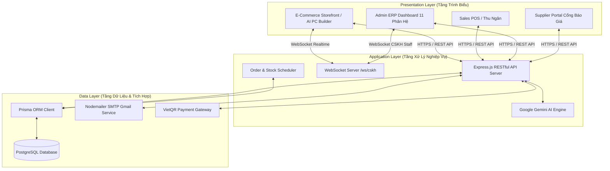
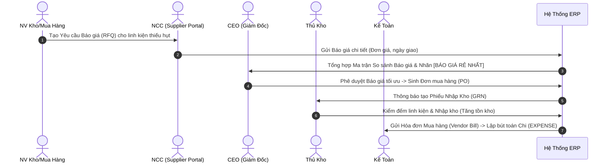
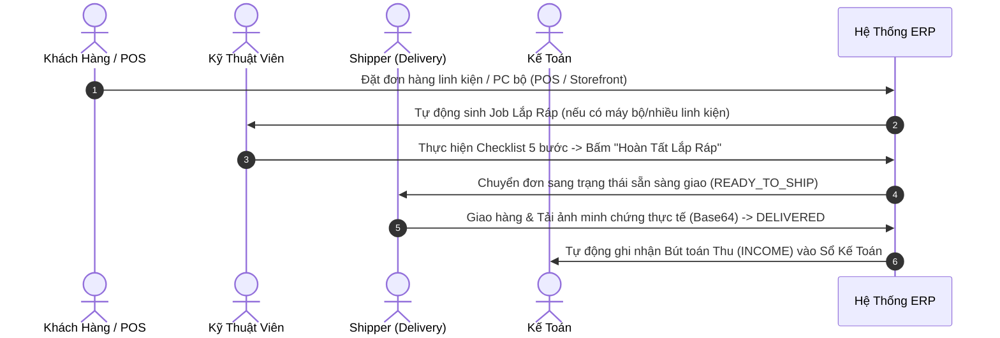
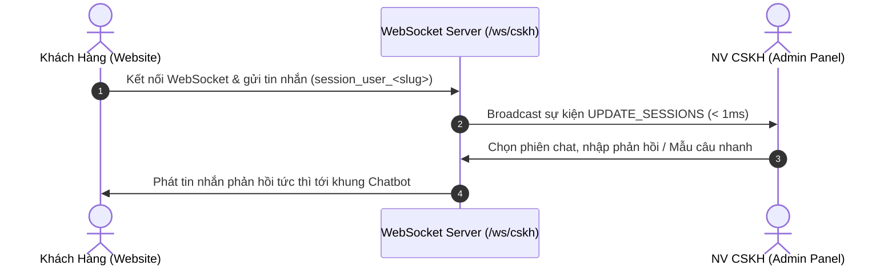

# HỆ THỐNG QUẢN TRỊ DOANH NGHIỆP (ERP) TÍCH HỢP AI VÀ WEBSOCKET REALTIME TRONG NGHÀNH RETAIL & LẮP RÁP LINH KIỆN MÁY TÍNH

> **Khóa Luận Tốt Nghiệp Đại Học — Trường Đại Học Công Nghiệp TP. Hồ Chí Minh (IUH)**  
> **Chuyên Ngành**: Hệ Thống Thông Tin — Khoa Công Nghệ Thông Tin  
> **Tên Đề Tài**: Xây dựng Hệ thống ERP Quản lý Bán lẻ Linh kiện Máy tính kết hợp Website Thương mại Điện tử, Trợ lý AI và Kênh Chat CSKH Realtime bằng WebSocket (**AetherPC ERP & Storefront**).

---

## MỤC LỤC

1. [1. Tổng Quan Hệ Thống & Bối Cảnh Đề Tài](#1-tổng-quan-hệ-thống--bối-cảnh-đề-tài)
2. [2. Kiến Trúc Hệ Thống & Sơ Đồ Khối](#2-kiến-trúc-hệ-thống--sơ-đồ-khối)
3. [3. Phân Quyền Vai Trò Người Dùng (RBAC Matrix)](#3-phân-quyền-vai-trò-người-dùng-rbac-matrix)
4. [4. Mô Tả Chi Tiết Quy Trình Vận Hành (Workflow Processes)](#4-mô-tả-chi-tiết-quy-trình-vận-hành-workflow-processes)
5. [5. Chi Tiết Tính Năng 11 Phân Hệ ERP & Storefront](#5-chi-tiết-tính-năng-11-phân-hệ-erp--storefront)
6. [6. Thuật Toán & Công Thức Toán Học Trong Hệ Thống](#6-thuật-toán--công-thức-toán-học-trong-hệ-thống)
7. [7. Danh Mục RESTful APIs & WebSocket Protocol](#7-danh-mục-restful-apis--websocket-protocol)
8. [8. Bộ Kịch Bản Kiểm Thử Chi Tiết (Test Suite)](#8-bộ-kịch-bản-kiểm-thử-chi-tiết-test-suite)
9. [9. Công Nghệ Sử Dụng (Tech Stack)](#9-công-nghệ-sử-dụng-tech-stack)
10. [10. Cấu Trúc Thư Mục Dự Án](#10-cấu-trúc-thư-mục-dự-án)
11. [11. Hướng Dẫn Khởi Chạy & Triển Khai (Deployment Guide)](#11-hướng-dẫn-khởi-chạy--triển-khai-deployment-guide)
12. [12. Danh Sách Tài Khoản Demo Hệ Thống](#12-danh-sách-tài-khoản-demo-hệ-thống)

---

## 1. Tổng Quan Hệ Thống & Bối Cảnh Đề Tài

Thị trường kinh doanh linh kiện máy tính và lắp ráp PC theo yêu cầu (Custom PC / Gaming Workstation) tại Việt Nam đòi hỏi khả năng xử lý dữ liệu phức tạp: hàng ngàn mã sản phẩm (SKU) với thông số kỹ thuật đa dạng (Socket CPU, Bus RAM, Form Factor Mainboard, Công suất TDP), biến động giá liên tục từ nhiều Nhà cung cấp, cùng các dịch vụ giá trị gia tăng như lắp ráp kỹ thuật, bảo hành và chăm sóc khách hàng.

**AetherPC ERP** được nghiên cứu và phát triển nhằm giải quyết triệt để các thách thức trên thông qua một **Hệ thống ERP Hợp nhất (Unified Enterprise Resource Planning)**, kết nối trực tiếp **Website Thương mại Điện tử (E-Commerce Storefront)**, **Trợ lý AI Tự động hóa (Google Gemini AI SDK)** và **Kênh Chat CSKH Realtime (WebSocket Server)**.

### Mục Tiêu Cốt Lõi:
1. **Tự động hóa luồng Procure-to-Pay (P2P)**: Đánh giá và chọn báo giá Nhà cung cấp tối ưu nhất bằng Thuật toán Ma trận Giá ($P_{\text{save}}$).
2. **Chuẩn hóa luồng Order-to-Cash (O2C)**: Tích hợp bán lẻ POS tại quầy, thanh toán QR Code VietQR, quy trình lắp ráp PC 5 bước kỹ thuật và giao hàng có minh chứng thực tế (Proof of Delivery).
3. **Chăm sóc khách hàng Realtime**: Xây dựng server WebSocket hai chiều hai kênh ($< 1\text{ms}$), phân định lịch sử trò chuyện độc lập theo từng tài khoản (`session_user_<slug>`).
4. **Quản trị Tài chính & Nhân sự**: Tính lương tự động theo 26 ngày công chuẩn Việt Nam, khấu trừ $10.5\%$ bảo hiểm và hạch toán Sổ Nhật ký Tài chính VAS.

---

## 2. Kiến Trúc Hệ Thống & Sơ Đồ Khối

Hệ thống được thiết kế theo kiến trúc 3 tầng (3-Tier Architecture) hiện đại, đảm bảo tính mở rộng, bảo mật và hiệu năng cao.



---

## 3. Phân Quyền Vai Trò Người Dùng (RBAC Matrix)

Hệ thống triển khai cơ chế Phân quyền dựa trên Vai trò (Role-Based Access Control - RBAC) nghiêm ngặt với 14 nhóm người dùng:

| STT | Mã Vai Trò (Role) | Chức Danh Phân Nhiệm | Mô Tả Quyền Hạn & Chức Năng Chi Tiết |
| :---: | :--- | :--- | :--- |
| 1 | `ceo` | Giám Đốc Điều Hành (CEO) | Quyền tối cao: Xem Executive Dashboard realtime, duyệt báo giá Mua hàng PO, duyệt giải ngân Bảng lương hàng tháng. |
| 2 | `admin` | Quản Trị Hệ Thống | Cấu hình hệ thống, quản lý tài khoản người dùng, xem nhật ký truy cập Audit Logs, cấp lại mật khẩu. |
| 3 | `sales_manager` | Quản Lý Bán Hàng | Quản lý danh mục đơn hàng bán lẻ POS & E-Commerce, duyệt hủy đơn, xem phân tích biểu đồ doanh số. |
| 4 | `sales` | Nhân Viên Bán Hàng POS | Bán hàng tại quầy, tìm kiếm/quét mã vạch sản phẩm, in hóa đơn thu ngân, nhận thanh toán VietQR. |
| 5 | `warehouse_manager`| Quản Lý Kho Bãi | Quản lý danh mục linh kiện PC, kiểm kê tồn kho, thiết lập ngưỡng an toàn (Safe/Warning/Out of stock). |
| 6 | `warehouse` | Thủ Kho | Thực hiện Phiếu nhập kho (GRN) từ PO mua hàng, Phiếu xuất kho linh kiện cho đơn bán lẻ và đơn lắp ráp. |
| 7 | `purchasing` | Nhân Viên Mua Hàng | Khởi tạo Yêu cầu Báo giá (RFQ) gửi đa NCC, xem Ma trận So sánh Báo giá, sinh đơn Mua hàng PO. |
| 8 | `supplier` | Cổng Nhà Cung Cấp (Portal) | Truy cập Supplier Portal tiếp nhận RFQ từ AetherPC, nhập đơn giá và cam kết ngày giao hàng. |
| 9 | `assembly` | Kỹ Thuật Viên Lắp Ráp | Nhận Job lắp ráp PC bộ, thực hiện Quy trình Checklist 5 bước kỹ thuật (Socket, Tản nhiệt, Đi dây, BIOS, Stress Test). |
| 10 | `hr` | Quản Lý Nhân Sự | Quản lý hồ sơ nhân viên, tính bảng lương tự động hàng tháng (Khấu trừ $10.5\%$ bảo hiểm, thưởng Sales $1\%$, thưởng lắp ráp $150k$). |
| 11 | `accounting` | Kế Toán Tài Chính | Quản lý Sổ Nhật ký Tài chính VAS (`INCOME`/`EXPENSE`), kiểm tra hóa đơn NCC (Vendor Bill), báo cáo P&L. |
| 12 | `cskh` | Chăm Sóc Khách Hàng | Quản lý Ticket bảo hành, tư vấn Live Chat WebSocket thời gian thực với khách hàng, duyệt Yêu cầu Đổi trả. |
| 13 | `delivery` | Nhân Viên Giao Hàng | Nhận đơn vận chuyển, tải ảnh minh chứng thực tế (`FileReader` Base64) khi giao thành công, ghi nhận lý do thất bại. |
| 14 | `customer` | Khách Hàng Cuối (Online) | Mua sắm linh kiện, tự cấu hình PC với AI kiểm tra xung đột phần cứng, tra cứu vận đơn, chat tư vấn với CSKH. |

---

## 4. Mô Tả Chi Tiết Quy Trình Vận Hành (Workflow Processes)

### 4.1. Quy Trình Mua Hàng & So Sánh Báo Giá NCC (Procure-to-Pay — P2P)



1. **Phát hiện nhu cầu**: Tồn kho linh kiện $\le 5$ tự động phát cảnh báo `WARNING`. Nhân viên Mua hàng (`purchasing`) khởi tạo **Yêu cầu Báo giá (RFQ)** tới 2+ Nhà cung cấp.
2. **Nhập báo giá trực tuyến**: Các Nhà cung cấp (`supplier`) truy cập **Supplier Portal** điền đơn giá và ngày giao hàng.
3. **Phân tích Ma trận Giá**: Hệ thống tự động so sánh báo giá, hiển thị phần trăm tiết kiệm $P_{\text{save}}$ và gắn nhãn `[BÁO GIÁ RẺ NHẤT]`.
4. **Phê duyệt PO & Nhập kho GRN**: CEO (`ceo`) phê duyệt -> Chuyển thành Đơn mua hàng (PO) chính thức. Thủ kho (`warehouse`) tạo Phiếu nhập kho (GRN) và cập nhật số lượng tồn.
5. **Thanh toán & Hạch toán**: Kế toán (`accounting`) kiểm tra khớp 3 bên (PO - GRN - Bill) và lập bút toán Chi (`EXPENSE`) vào Sổ Nhật ký Tài chính VAS.

---

### 4.2. Quy Trình Bán Hàng, Lắp Ráp & Giao Hàng (Order-to-Cash — O2C)



1. **Khởi tạo đơn hàng**: Khách hàng đặt mua trực tuyến hoặc Thu ngân lập đơn POS tại quầy.
2. **Khởi tạo Lệnh Lắp Ráp**: Đơn hàng chứa máy bộ tự động sinh Job cho Kỹ thuật viên (`assembly`).
3. **Thực hiện Checklist 5 Bước Kỹ Thuật**:
   - **Bước 1**: Kiểm tra tương thích Socket CPU (LGA1700, AM5) & Mainboard.
   - **Bước 2**: Tra keo tản nhiệt tiêu chuẩn & lắp đặt tản nhiệt.
   - **Bước 3**: Đi dây nguồn (Cable Management) gọn gàng trong Case.
   - **Bước 4**: Cấu hình BIOS & Boot thử nghiệm hệ điều hành.
   - **Bước 5**: Chạy Stress Test kiểm tra nhiệt độ CPU/GPU & độ ổn định.
4. **Giao hàng & Minh chứng**: Shipper (`delivery`) tiếp nhận đơn, mở modal Phân công Shipper, thực hiện giao hàng và tải ảnh minh chứng thực tế (`FileReader` Base64) kèm ghi chú người nhận.
5. **Hạch toán doanh thu**: Kế toán ghi nhận bút toán Thu (`INCOME`) vào Sổ Nhật ký Tài chính.

---

### 4.3. Quy Trình Tư Vấn CSKH Realtime Qua WebSocket



---

## 5. Chi Tiết Tính Năng 11 Phân Hệ ERP & Storefront

### 5.1. Phân Hệ Ban Giám Đốc (Executive Dashboard)
- **KPIs Doanh Số Thời Gian Thực**: Tổng doanh thu, tổng đơn hàng, tỷ lệ hoàn tất, doanh số POS vs E-Commerce.
- **Biểu Đồ Phân Phối Danh Mục Việt Hóa**: Biểu đồ thể hiện cơ cấu linh kiện bán ra (CPU, VGA, Mainboard, RAM,...).
- **Bộ Lọc Khoảng Thời Gian Thống Nhất (`Từ ngày — Đến ngày`)**: Tự động đồng bộ tất cả chỉ số theo khoảng ngày chọn.
- **Drilldown Modals**: Bấm vào thẻ KPI để xem danh sách chi tiết đơn hàng đóng góp.

### 5.2. Phân Hệ Quản Lý Bán Hàng (Sales POS)
- **Giao Diện Thu Ngân POS**: Tìm kiếm linh kiện theo tên/SKU, quét mã vạch sản phẩm.
- **Tích Hợp Thanh Toán VietQR**: Tiền mặt, chuyển khoản QR Code VietQR tự động.
- **Sổ Đăng Ký Đơn Hàng**: Bộ lọc trạng thái và khoảng thời gian `Từ ngày — Đến ngày`.

### 5.3. Phân Hệ Quản Lý Kho (Warehouse Management)
- **Quản Lý Linh Kiện PC**: Phân loại theo 3 ngưỡng rủi ro (SAFE, WARNING, OUT_OF_STOCK).
- **Stock Movement Audit Logs**: Theo dõi lịch sử giao dịch Nhập kho (IN) và Xuất kho (OUT).
- **Xác Nhận Xuất Kho & Phân Công Shipper**: Bật modal chọn Shipper trực tiếp trong bảng Chi tiết đơn hàng và gửi thông báo hệ thống Realtime.

### 5.4. Phân Hệ Mua Hàng & So Sánh Báo Giá NCC (Purchasing & RFQ)
- **Ma Trận So Sánh Báo Giá Đa NCC (Price Matrix)**: Tự động so sánh báo giá từ 2+ Nhà cung cấp.
- **Thuật Toán Chọn Báo Giá Rẻ Nhất**: Gắn nhãn badge `[BÁO GIÁ RẺ NHẤT]` cho phương án tiết kiệm nhất.
- **Đồng Bộ Số Lượng Đề Xuất (RFQ)**: Giữ đúng 100% số lượng đề xuất thực tế từ Thủ Kho (ví dụ: 63 cái, 25 cái).

### 5.5. Phân Hệ Quản Lý Lắp Ráp PC (Custom PC Assembly)
- **Lệnh Lắp Ráp Động**: Tự động sinh Job lắp ráp khi đơn hàng chứa máy tính bộ.
- **Checklist Kỹ Thuật 5 Bước**: Quản lý quy trình lắp ráp từ Socket, Keo tản nhiệt, Đi dây, BIOS đến Stress Test.

### 5.6. Phân Hệ Quản Lý Nhân Sự & Bảng Lương (HR & Payroll)
- **Quy Chuẩn 26 Ngày Công**: Tính lương theo công thức hợp đồng chuẩn Việt Nam.
- **Khấu Trừ & Thưởng**: Khấu trừ $10.5\%$ bảo hiểm, cộng thưởng Sales ($1\%$) và thưởng lắp ráp ($150k$/máy).
- **MyPayroll Portal**: Cho phép nhân viên tra cứu phiếu lương cá nhân.

### 5.7. Phân Hệ Kế Toán Tài Chính (Financial Accounting)
- **Sổ Nhật Ký Tài Chính (VAS Ledger)**: Quản lý toàn bộ thu nhập (`INCOME`) và chi phí (`EXPENSE`).
- **Báo Cáo P&L (Profit & Loss)**: Doanh thu thực nhận trừ Giá vốn hàng bán (COGS) và Chi phí vận hành (OPEX).

### 5.8. Phân Hệ Giao Hàng & Vận Chuyển (Delivery Logistics)
- **Minh Chứng Giao Hàng Thành Công**: Tải trực tiếp ảnh minh chứng thực tế từ máy (`FileReader` Base64) kèm ghi chú người nhận.
- **Ghi Nhận Giao Thất Bại**: Chọn 1 trong 6 lý do phổ biến kèm ghi chú chi tiết.

### 5.9. Phân Hệ Chăm Sóc Khách Hàng (CSKH / CRM)
- **Tư Vấn Live Chat WebSocket**: Chat 1-1 realtime qua WebSocket Server `ws://localhost:5000/ws/cskh`.
- **Quản lý Ticket & Đổi Trả**: Quản lý ticket khiếu nại bảo hành và phê duyệt đơn đổi trả.

### 5.10. Storefront Online & Trợ Lý AI Antigravity
- **Tự Build PC Thông Minh**: Tự động kiểm tra xung đột Socket CPU/Mainboard và công suất nguồn PSU ($\le 80\%$ TDP).
- **Trợ Lý AI Chatbot**: Google Gemini AI SDK tư vấn cấu hình PC theo ngân sách và nhu cầu sử dụng.

---

## 6. Thuật Toán & Công Thức Toán Học Trong Hệ Thống

### 6.1. Thuật Toán So Sánh Báo Giá Nhà Cung Cấp ($P_{\text{save}}$)
Cho tập hợp các báo giá $T = \{T_1, T_2, \dots, T_n\}$ gửi từ các Nhà cung cấp cho cùng một yêu cầu RFQ:
$$T_{\min} = \min(T), \quad T_{\max} = \max(T)$$
Tỷ lệ chi phí tiết kiệm được khi phê duyệt phương án rẻ nhất được tính theo công thức:
$$P_{\text{save}} = \left( \frac{T_{\max} - T_{\min}}{T_{\max}} \right) \times 100\%$$

### 6.2. Công Thức Tính Bảng Lương Hàng Tháng (Payroll Model)
Lương thực nhận ($L_{\text{net}}$) của nhân viên trong tháng được xác định theo quy chuẩn 26 ngày công:
$$L_{\text{gross}} = \left( L_{\text{cơ bản}} \times \frac{D_{\text{công}}}{26} \right) + K_{\text{sales}} \cdot 1\% + N_{\text{lắp ráp}} \cdot 150.000\text{đ}$$
$$L_{\text{khấu trừ}} = L_{\text{gross}} \times 10.5\% \quad (8\% \text{ BHXH} + 1.5\% \text{ BHYT} + 1\% \text{ BHTN})$$
$$L_{\text{net}} = L_{\text{gross}} - L_{\text{khấu trừ}}$$

### 6.3. Thuật Toán Kiểm Tra Công Suất Nguồn PSU Khi Build PC
Để hệ thống máy tính hoạt động bền bỉ, tổng điện năng tiêu thụ (TDP) của tất cả linh kiện không được vượt quá $80\%$ công suất danh định của Nguồn PSU:
$$P_{\text{tổng TDP}} = \text{TDP}_{\text{CPU}} + \text{TDP}_{\text{GPU}} + \text{TDP}_{\text{Mainboard}} + \text{TDP}_{\text{Khác}}$$
$$P_{\text{PSU khuyến nghị}} \ge \frac{P_{\text{tổng TDP}}}{0.80}$$

---

## 7. Danh Mục RESTful APIs & WebSocket Protocol

### 7.1. RESTful APIs Endpoints (Base URL: `http://localhost:5000/api/v1`)

| Phân Hệ | Phương Thức | Endpoint | Mô Tả Chức Năng |
| :--- | :---: | :--- | :--- |
| **Auth** | `POST` | `/auth/login` | Đăng nhập tài khoản Khách hàng / Nhân viên |
| **Auth** | `GET` | `/auth/me` | Lấy thông tin tài khoản hiện tại từ JWT Token |
| **Products** | `GET` | `/products` | Lấy danh sách linh kiện PC kèm bộ lọc/tìm kiếm |
| **Orders** | `POST` | `/orders` | Tạo đơn hàng mới (POS / Storefront) |
| **Orders** | `PATCH` | `/orders/:id/delivery-proof` | Tải ảnh minh chứng giao hàng & cập nhật trạng thái |
| **Purchasing**| `POST` | `/purchasing/rfq` | Khởi tạo Yêu cầu Báo giá (RFQ) tới đa NCC |
| **Purchasing**| `GET` | `/purchasing/matrix` | Lấy Ma trận So sánh Báo giá Nhà cung cấp |
| **HR** | `GET` | `/hr/payroll` | Tự động tính toán Bảng lương hàng tháng |
| **Chat CSKH** | `GET` | `/chat/cskh/sessions` | Lấy danh sách phiên chat tư vấn CSKH |

### 7.2. Giao Thức WebSocket Realtime (`ws://localhost:5000/ws/cskh`)

| Tên Sự Kiện (Type) | Chi Chiều Gửi | Payload Cấu Trúc | Mô Tả Tác Vụ |
| :--- | :---: | :--- | :--- |
| `INIT_SESSIONS` | Server $\rightarrow$ Client | `{ sessions: Array }` | Gửi toàn bộ dữ liệu các phiên chat khi mới kết nối |
| `CUSTOMER_SEND_MSG` | Customer $\rightarrow$ Server | `{ sessionId, text, customerName }` | Khách hàng gửi tin nhắn mới tới Server |
| `STAFF_SEND_MSG` | Staff $\rightarrow$ Server | `{ sessionId, text }` | NV CSKH phản hồi tin nhắn cho khách hàng |
| `UPDATE_SESSIONS` | Server $\rightarrow$ All Clients | `{ sessions: Array, newMsg }` | Phát thông điệp cập nhật tin nhắn tức thì ($< 1\text{ms}$) |
| `DELETE_SESSION` | Staff $\rightarrow$ Server | `{ sessionId }` | Xóa hoàn toàn 1 phiên chat cũ khỏi Server |

---

## 8. Bộ Kịch Bản Kiểm Thử Chi Tiết (Test Suite)

### 8.1. Phân Hệ Ban Giám Đốc (Executive Dashboard)

| Test ID | Tên Kịch Bản Test | Các Bước Thực Hiện | Kết Quả Kỳ Vọng |
| :---: | :--- | :--- | :--- |
| `TC-DASH-01` | Lọc dữ liệu KPI theo khoảng thời gian tùy chỉnh | 1. Đăng nhập tài khoản `ceo`.<br>2. Tại Dashboard, chọn bộ lọc thời gian từ `01/08/2026` đến `04/08/2026`.<br>3. Quan sát các thẻ KPI. | Doanh thu, số đơn hàng và biểu đồ danh mục tự động cập nhật chính xác theo dữ liệu phát sinh trong khoảng thời gian đã chọn. |
| `TC-DASH-02` | Xem danh sách chi tiết khi click thẻ KPI | 1. Click vào thẻ KPI "Tổng Doanh Thu".<br>2. Quan sát Modal danh sách đơn đóng góp. | Modal hiển thị danh sách đơn hàng tương ứng, có mã đơn, tên khách và giá trị chính xác. |

### 8.2. Phân Hệ Quản Lý Bán Hàng (Sales POS)

| Test ID | Tên Kịch Bản Test | Các Bước Thực Hiện | Kết Quả Kỳ Vọng |
| :---: | :--- | :--- | :--- |
| `TC-POS-01` | Lập đơn bán lẻ & Thanh toán QR Code tại quầy | 1. Đăng nhập tài khoản `sales`.<br>2. Tìm và thêm SP `VGA ASUS RTX 3080` vào giỏ.<br>3. Chọn phương thức "Chuyển khoản QR".<br>4. Nhấn "Thanh Toán". | Hệ thống hiển thị mã QR Code chuyển khoản, sau khi xác nhận đơn hàng thành công, tự động giảm tồn kho VGA đi 1 và ghi nhận doanh thu POS. |

### 8.3. Phân Hệ Quản Lý Kho (Warehouse)

| Test ID | Tên Kịch Bản Test | Các Bước Thực Hiện | Kết Quả Kỳ Vọng |
| :---: | :--- | :--- | :--- |
| `TC-WH-01` | Lọc Lịch Sử Biến Động Kho (IN/OUT) | 1. Đăng nhập tài khoản `warehouse_manager`.<br>2. Vào tab "Lịch Sử Biến Động Xuất Nhập Kho".<br>3. Chọn Từ ngày `01/08/2026` Đến ngày `04/08/2026` và chọn loại `Nhập kho (IN)`. | Bảng hiển thị lịch sử nhập kho trong khoảng ngày chính xác. |
| `TC-WH-02` | Xác nhận xuất kho & Phân công Shipper | 1. Mở Chi tiết đơn hàng.<br>2. Nhấn "Xác Nhận Xuất Kho".<br>3. Chọn Shipper 1 và bấm "Xác Nhận Xuất Kho & Phân Công". | Tự động gửi thông báo hệ thống Realtime, chuyển trạng thái đơn sang `READY_TO_SHIP` và đóng cả 2 modal. |

---

## 9. Công Nghệ Sử Dụng (Tech Stack)

### Frontend
- **Core Framework**: React.js (v18) xây dựng trên nền Vite bundling tool.
- **Styling**: Vanilla CSS Custom Variables, hiệu ứng Glassmorphic UI cao cấp, font chữ **Inter**.
- **Realtime Sync**: WebSocket Client & Inter-tab BroadcastChannel API.
- **Icons & UI**: Lucide React Icons, Chart.js / React-Chartjs-2.
- **State Management**: `ERPContext`, `CartContext`, `AuthContext`.

### Backend
- **Framework**: Node.js & Express.js RESTful API.
- **Realtime Engine**: WebSocket Server (`ws` library) khởi chạy trên `ws://localhost:5000/ws/cskh`.
- **Database & ORM**: PostgreSQL v15 & Prisma ORM.
- **Security & Auth**: JSON Web Token (JWT) & bcryptjs password hashing.
- **AI Integration**: Google Generative AI SDK (`@google/generative-ai` - Gemini 1.5 Flash).
- **Email Notification**: Nodemailer Service tích hợp Gmail App Password.

### Deployment & Tools
- **Docker Compose**: Containerization trọn gói Frontend, Backend và PostgreSQL Database.
- **Data Generator**: Script Python cào và chuẩn hóa dữ liệu linh kiện PC thực tế.

---

## 10. Cấu Trúc Thư Mục Dự Án

```
ERP_AetherPC/
├── backend/                  # Server Node.js (Express + Prisma ORM + WebSocket Server + Gmail SMTP)
│   ├── prisma/               # Schema cơ sở dữ liệu Prisma & Seed migration
│   ├── src/
│   │   ├── config/           # Cấu hình JWT, Database & Nodemailer SMTP
│   │   ├── controllers/      # Bộ xử lý nghiệp vụ Order, Purchasing, HR, ERP, Chat CSKH
│   │   ├── middlewares/      # Phân quyền RBAC, AuthToken JWT validation
│   │   ├── routes/           # REST API endpoints (Orders, Purchasing, Delivery, Chat CSKH)
│   │   └── services/         # WebSocket Service (ws/cskh), Email service (Gmail SMTP)
│   ├── .env.example          # Tệp cấu hình môi trường mẫu cho Backend
│   └── Dockerfile            # Cấu hình Docker build Backend
├── frontend/                 # Client Single Page Application (React + Vite + Lucide)
│   ├── src/
│   │   ├── components/       # UI Components tái sử dụng (Layout, Modals, Chatbot AI/CSKH)
│   │   ├── context/          # React Context State (AuthContext, CartContext, ERPContext)
│   │   ├── pages/            # Các trang phân hệ ERP & Storefront
│   │   │   ├── Admin/        # 11 Phân hệ Quản trị ERP
│   │   │   ├── Storefront/   # Các trang cửa hàng Online & AI PC Builder
│   │   │   └── SupplierPortal/ # Cổng tương tác báo giá cho Nhà Cung Cấp
│   │   └── services/         # Axios/Fetch API Client & helper utilities
│   ├── .env.example          # Tệp cấu hình môi trường mẫu cho Frontend
│   └── Dockerfile            # Cấu hình Docker build Frontend
├── database/                 # SQL Schema chuẩn & script khởi tạo Seed DB
├── docs/                     # Tài liệu Khóa luận Tốt nghiệp IUH (.docx) & Sơ đồ UML/BPMN
├── scraper/                  # Python Scraper cào & làm sạch linh kiện PC thực tế
├── scripts/                  # Scripts hỗ trợ xuất báo cáo luận văn IUH
└── docker-compose.yml        # Cấu hình containerization trọn gói (Frontend, Backend, Postgres)
```

---

## 11. Hướng Dẫn Khởi Chạy & Triển Khai (Deployment Guide)

### Cách 1: Khởi Chạy Bằng Docker Compose (Khuyên dùng)

1. **Khởi tạo tệp môi trường từ bản mẫu**:
   ```bash
   cp backend/.env.example backend/.env
   cp frontend/.env.example frontend/.env
   ```

2. **Chạy Docker Compose**:
   ```bash
   docker-compose up --build -d
   ```

3. **Truy cập ứng dụng**:
   - **Storefront & Admin ERP**: `http://localhost:3000`
   - **Backend REST API**: `http://localhost:5000`
   - **WebSocket Realtime CSKH**: `ws://localhost:5000/ws/cskh`

---

### Cách 2: Khởi Chạy Thủ Công (Development Mode)

1. **Backend Server**:
   ```bash
   cd backend
   npm install
   npm run dev
   ```

2. **Frontend SPA Application**:
   ```bash
   cd frontend
   npm install
   npm run dev
   ```

---

## 12. Danh Sách Tài Khoản Demo Hệ Thống

Đăng nhập tại trang `/login` bằng các tài khoản demo (Mật khẩu mặc định: `123456`):

| STT | Vai Trò (Role) | Chức Danh Phân Nhiệm | Username | Mật khẩu mẫu |
| :---: | :--- | :--- | :--- | :--- |
| 1 | `ceo` | Giám Đốc Điều Hành (CEO) | `ceo` | `123456` |
| 2 | `admin` | Quản Trị Hệ Thống | `admin` | `123456` |
| 3 | `sales_manager` | Quản Lý Bán Hàng | `sales_manager` | `123456` |
| 4 | `sales` | Nhân Viên Bán Hàng POS | `sales` | `123456` |
| 5 | `warehouse_manager`| Quản Lý Kho Bãi | `warehouse_manager` | `123456` |
| 6 | `warehouse` | Thủ Kho | `warehouse` | `123456` |
| 7 | `purchasing` | Nhân Viên Mua Hàng | `purchasing` | `123456` |
| 8 | `supplier` | Nhà Cung Cấp Đối Tác | `supplier` | `123456` |
| 9 | `assembly` | Kỹ Thuật Lắp Ráp PC | `assembly` | `123456` |
| 10 | `hr` | Quản Lý Nhân Sự | `hr` | `123456` |
| 11 | `accounting` | Kế Toán Tài Chính | `accounting` | `123456` |
| 12 | `cskh` | Chăm Sóc Khách Hàng | `cskh` | `123456` |
| 13 | `delivery` | Nhân Viên Giao Hàng | `delivery` | `123456` |
| 14 | `customer_b2b` | Khách Hàng Doanh Nghiệp | `customer_b2b` | `123456` |

---

## Báo Cáo Khóa Luận Tốt Nghiệp (.docx)

Tài liệu báo cáo chính thức lưu trữ tại:  
`docs/Bao_Cao_Khoa_Luan_Tot_Nghiep_IUH_AetherPC_ERP.docx`

---

## Bản Quyền & Giấy Phép
Dự án hoàn thiện phục vụ Khóa luận Tốt nghiệp Đại học chuyên ngành Hệ thống Thông tin — Khoa Công nghệ Thông tin — Trường Đại học Công nghiệp TP. Hồ Chí Minh (IUH). Tất cả quyền được bảo lưu © 2026.
