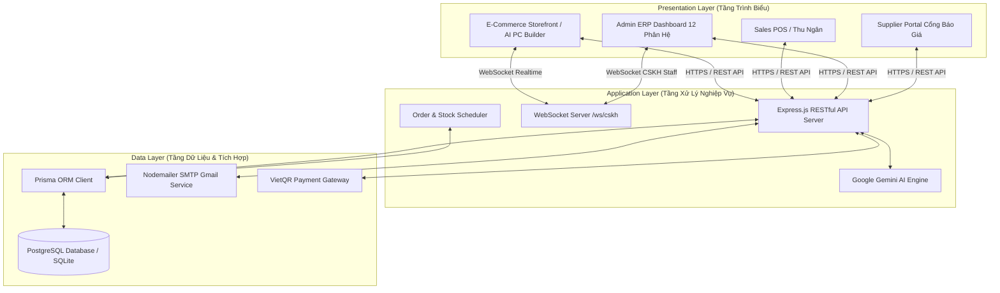
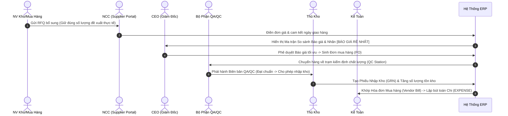
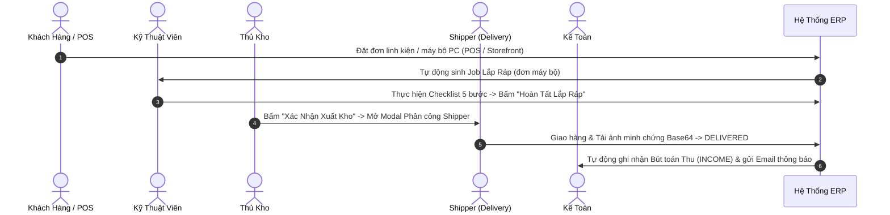

# HỆ THỐNG QUẢN TRỊ DOANH NGHIỆP (ERP) TÍCH HỢP AI VÀ WEBSOCKET REALTIME TRONG NGÀNH RETAIL & LẮP RÁP LINH KIỆN MÁY TÍNH

> **Khóa Luận Tốt Nghiệp Đại Học — Trường Đại Học Công Nghiệp TP. Hồ Chí Minh (IUH)**  
> **Chuyên Ngành**: Hệ Thống Thông Tin — Khoa Công Nghệ Thông Tin  
> **Tên Đề Tài**: Xây dựng Hệ thống ERP Quản lý Bán lẻ Linh kiện Máy tính kết hợp Website Thương mại Điện tử, Trợ lý AI và Kênh Chat CSKH Realtime bằng WebSocket (**AetherPC ERP & Storefront**).

---

## MỤC LỤC

1. [1. Tổng Quan Hệ Thống & Bối Cảnh Đề Tài](#1-tổng-quan-hệ-thống--bối-cảnh-đề-tài)
2. [2. Kiến Trúc Hệ Thống & Sơ Đồ Khối](#2-kiến-trúc-hệ-thống--sơ-đồ-khối)
3. [3. Danh Sách 14 Vai Trò & Ma Trận Phân Quyền (RBAC Matrix)](#3-danh-sách-14-vai-trò--ma-trận-phân-quyền-rbac-matrix)
4. [4. Mô Tả Chi Tiết Quy Trình Vận Hành (Workflow Processes)](#4-mô-tả-chi-tiết-quy-trình-vận-hành-workflow-processes)
5. [5. Chi Tiết Tính Năng 12 Phân Hệ ERP Admin & Storefront](#5-chi-tiết-tính-năng-12-phân-hệ-erp-admin--storefront)
6. [6. Thuật Toán & Công Thức Toán Học Trong Hệ Thống](#6-thuật-toán--công-thức-toán-học-trong-hệ-thống)
7. [7. Danh Mục RESTful APIs & WebSocket Protocol](#7-danh-mục-restful-apis--websocket-protocol)
8. [8. Bộ Kịch Bản Kiểm Thử Chi Tiết (Comprehensive Test Suite)](#8-bộ-kịch-bản-kiểm-thử-chi-tiết-comprehensive-test-suite)
9. [9. Công Nghệ Sử Dụng (Tech Stack)](#9-công-nghệ-sử-dụng-tech-stack)
10. [10. Cấu Trúc Thư Mục Dự Án Toàn Diện](#10-cấu-trúc-thư-mục-dự-án-toàn-diện)
11. [11. Hướng Dẫn Khởi Chạy & Triển Khai (Deployment Guide)](#11-hướng-dẫn-khởi-chạy--triển-khai-deployment-guide)
12. [12. Danh Sách 14 Tài Khoản Demo Hệ Thống](#12-danh-sách-14-tài-khoản-demo-hệ-thống)

---

## 1. Tổng Quan Hệ Thống & Bối Cảnh Đề Tài

Thị trường kinh doanh linh kiện máy tính và lắp ráp PC theo yêu cầu (Custom PC / Gaming Workstation) tại Việt Nam đòi hỏi khả năng xử lý dữ liệu phức tạp: hàng ngàn mã sản phẩm (SKU) với thông số kỹ thuật đa dạng (Socket CPU, Bus RAM, Form Factor Mainboard, Công suất TDP), biến động giá liên tục từ nhiều Nhà cung cấp, cùng các dịch vụ giá trị gia tăng như kiểm định chất lượng QA/QC, lắp ráp kỹ thuật, bảo hành và chăm sóc khách hàng.

**AetherPC ERP** được nghiên cứu và phát triển nhằm giải quyết triệt để các thách thức trên thông qua một **Hệ thống ERP Hợp nhất (Unified Enterprise Resource Planning)**, kết nối trực tiếp **Website Thương mại Điện tử (E-Commerce Storefront)**, **Trợ lý AI Tự động hóa (Google Gemini AI SDK)**, **Hệ thống Kiểm định QA/QC** và **Kênh Chat CSKH Realtime (WebSocket Server)**.

### Các Mục Tiêu Cốt Lõi:
1. **Tự động hóa luồng Procure-to-Pay (P2P)**: Đánh giá và chọn báo giá Nhà cung cấp tối ưu nhất bằng Thuật toán Ma trận Giá ($P_{\text{save}}$), gửi RFQ đồng bộ đúng 100% số lượng đề xuất thực tế từ Thủ Kho.
2. **Kiểm định chất lượng nghiêm ngặt (QA/QC)**: Kiểm đếm linh kiện nhập kho, lập biên bản kiểm định và phân loại sản phẩm lỗi trước khi cho phép nhập kho chính thức.
3. **Chuẩn hóa luồng Order-to-Cash (O2C)**: Tích hợp bán lẻ POS tại quầy, thanh toán QR Code VietQR, quy trình lắp ráp PC 5 bước kỹ thuật, phân công Shipper và giao hàng có minh chứng thực tế (Proof of Delivery).
4. **Chăm sóc khách hàng Realtime**: Xây dựng server WebSocket hai chiều hai kênh ($< 1\text{ms}$), phân định lịch sử trò chuyện độc lập theo từng tài khoản (`session_user_<slug>`).
5. **Quản trị Tài chính & Nhân sự**: Tính lương tự động theo 26 ngày công chuẩn Việt Nam, khấu trừ $10.5\%$ bảo hiểm, tính thưởng Sales $1\%$ và thưởng lắp ráp $150k$/máy, hạch toán Sổ Nhật ký Tài chính VAS.

---

## 2. Kiến Trúc Hệ Thống & Sơ Đồ Khối

Hệ thống được thiết kế theo kiến trúc 3 tầng (3-Tier Architecture) hiện đại, đảm bảo tính mở rộng, bảo mật và hiệu năng cao.



---

## 3. Danh Sách 14 Vai Trò & Ma Trận Phân Quyền (RBAC Matrix)

Hệ thống triển khai cơ chế Phân quyền dựa trên Vai trò (Role-Based Access Control - RBAC) nghiêm ngặt với 14 nhóm người dùng:

| STT | Mã Vai Trò (Role) | Chức Danh Phân Nhiệm | Mô Tả Quyền Hạn & Chức Năng Chi Tiết |
| :---: | :--- | :--- | :--- |
| 1 | `ceo` | Giám Đốc Điều Hành (CEO) | Quyền tối cao: Xem Executive Dashboard realtime, duyệt báo giá Mua hàng PO, duyệt giải ngân Bảng lương hàng tháng. |
| 2 | `admin` | Quản Trị Hệ Thống | Cấu hình hệ thống, quản lý tài khoản người dùng, xem nhật ký truy cập Audit Logs, cấp lại mật khẩu. |
| 3 | `sales_manager` | Quản Lý Bán Hàng | Quản lý danh mục đơn hàng bán lẻ POS & E-Commerce, duyệt hủy đơn, xem phân tích biểu đồ doanh số. |
| 4 | `sales` | Nhân Viên Bán Hàng POS | Bán hàng tại quầy, tìm kiếm/quét mã vạch sản phẩm, in hóa đơn thu ngân, nhận thanh toán VietQR. |
| 5 | `warehouse_manager`| Quản Lý Kho Bãi | Quản lý danh mục linh kiện PC, kiểm kê tồn kho, thiết lập ngưỡng an toàn (Safe/Warning/Out of stock). |
| 6 | `warehouse` | Thủ Kho | Thực hiện Phiếu nhập kho (GRN) từ PO mua hàng, Phiếu xuất kho linh kiện cho đơn bán lẻ và đơn lắp ráp. |
| 7 | `purchasing` | Nhân Viên Mua Hàng | Khởi tạo Yêu cầu Báo giá (RFQ) gửi đa NCC, xem Ma trận So sánh Báo giá, sinh đơn Mua hàng PO. |
| 8 | `supplier` | Cổng Nhà Cung Cấp (Portal) | Truy cập Supplier Portal tiếp nhận RFQ từ AetherPC, nhập đơn giá và cam kết ngày giao hàng. |
| 9 | `qc` / `qa` | Kiểm Định Chất Lượng | Thực hiện quy trình kiểm tra chất lượng linh kiện nhập kho, ghi nhận tỷ lệ lỗi, phát hành biên bản QA/QC. |
| 10 | `assembly` | Kỹ Thuật Viên Lắp Ráp | Nhận Job lắp ráp PC bộ, thực hiện Quy trình Checklist 5 bước kỹ thuật (Socket, Tản nhiệt, Đi dây, BIOS, Stress Test). |
| 11 | `hr` | Quản Lý Nhân Sự | Quản lý hồ sơ nhân viên, tính bảng lương tự động hàng tháng (Khấu trừ $10.5\%$ bảo hiểm, thưởng Sales $1\%$, thưởng lắp ráp $150k$). |
| 12 | `accounting` | Kế Toán Tài Chính | Quản lý Sổ Nhật ký Tài chính VAS (`INCOME`/`EXPENSE`), kiểm tra hóa đơn NCC (Vendor Bill), báo cáo P&L. |
| 13 | `cskh` | Chăm Sóc Khách Hàng | Quản lý Ticket bảo hành, tư vấn Live Chat WebSocket thời gian thực với khách hàng, duyệt Yêu cầu Đổi trả. |
| 14 | `delivery` | Nhân Viên Giao Hàng | Nhận đơn vận chuyển, tải ảnh minh chứng thực tế (`FileReader` Base64) khi giao thành công, ghi nhận lý do thất bại. |

---

## 4. Mô Tả Chi Tiết Quy Trình Vận Hành (Workflow Processes)

### 4.1. Quy Trình Mua Hàng, Báo Giá & Kiểm Định Chất Lượng (P2P — Procure-to-Pay)



1. **Khởi tạo RFQ**: Khi hàng tồn kho $\le 5$, Kho phát cảnh báo `WARNING`. Nhân viên Mua hàng (`purchasing`) tạo RFQ với đúng 100% số lượng đề xuất (không bị ép về 10).
2. **Nhập báo giá & So sánh**: Nhà cung cấp nhập báo giá qua **Supplier Portal**. Hệ thống tính tỷ lệ tiết kiệm $P_{\text{save}}$ và gắn nhãn `[BÁO GIÁ RẺ NHẤT]`.
3. **Phê duyệt & QC Kiểm định**: CEO duyệt PO -> Hàng về cửa hàng được bộ phận **QA/QC** kiểm tra thông số kỹ thuật và phát hành Biên bản QC.
4. **Nhập kho GRN & Hạch toán**: Thủ kho nhập hàng vào kho chính -> Kế toán lập bút toán Chi (`EXPENSE`) vào Sổ Nhật ký Tài chính VAS.

---

### 4.2. Quy Trình Bán Hàng, Lắp Ráp & Giao Hàng (O2C — Order-to-Cash)



---

## 5. Chi Tiết Tính Năng 12 Phân Hệ ERP Admin & Storefront

### 5.1. Executive Dashboard (`Dashboard.jsx`)
- KPIs thời gian thực: Tổng doanh thu, tổng đơn hàng, tỷ lệ hoàn thành, phân rã doanh số POS vs Storefront.
- Biểu đồ phân bố danh mục linh kiện bán ra.
- Bộ lọc khoảng thời gian thống nhất (`Từ ngày — Đến ngày`).
- Drilldown Modals xem danh sách đơn hàng chi tiết khi click thẻ KPI.

### 5.2. Sales POS Thu Ngân (`SalesPOS.jsx`)
- Tìm kiếm sản phẩm theo Tên/SKU, hỗ trợ quét mã vạch Barcode scanner.
- Thanh toán đa phương thức: Tiền mặt, Chuyển khoản QR Code VietQR tự động.
- In hóa đơn bán lẻ tại quầy và quản lý sổ đăng ký đơn hàng.

### 5.3. Quản Lý Kho Bãi (`Warehouse.jsx`)
- Quản lý 1.580 linh kiện PC theo 3 ngưỡng rủi ro (`SAFE`, `WARNING`, `OUT_OF_STOCK`).
- Theo dõi nhật ký biến động xuất nhập kho (Stock Movement Audit Logs).
- **Xác Nhận Xuất Kho & Phân Công Shipper**: Bật modal chọn Shipper trực tiếp trong bảng Chi tiết đơn hàng, tự động đóng cả 2 modal và gửi thông báo hệ thống Realtime.

### 5.4. Mua Hàng & RFQ (`Purchasing.jsx`)
- Ma trận so sánh báo giá đa NCC với thuật toán chọn phương án tiết kiệm nhất $P_{\text{save}}$.
- **Đồng bộ đúng số lượng đề xuất**: Tiếp nhận chuẩn xác số lượng từ cảnh báo kho (ví dụ: 63 cái, 25 cái) khi mở form khởi tạo RFQ.

### 5.5. Kiểm Định Chất Lượng QA/QC (`QualityControl.jsx`)
- Kiểm tra quy chuẩn linh kiện nhập kho từ Nhà cung cấp.
- Đánh giá tỷ lệ linh kiện đạt chuẩn vs linh kiện lỗi nhà sản xuất (DOA).
- Khởi tạo Biên bản Kiểm định QA/QC trước khi chuyển kho chính.

### 5.6. Quản Lý Lắp Ráp PC (`Assembly.jsx`)
- Tự động sinh Job lắp ráp máy bộ PC.
- Quy trình Checklist 5 bước kỹ thuật:
  - **Bước 1**: Kiểm tra tương thích Socket CPU & Mainboard.
  - **Bước 2**: Tra keo tản nhiệt & lắp tản nhiệt.
  - **Bước 3**: Đi dây nguồn (Cable Management).
  - **Bước 4**: Cấu hình BIOS & Boot OS.
  - **Bước 5**: Chạy Stress Test kiểm tra nhiệt độ CPU/GPU.
- Tự động cộng $150.000$đ thưởng kỹ thuật cho nhân viên hoàn thành.

### 5.7. Quản Lý Nhân Sự & Bảng Lương (`HRManager.jsx` & `MyPayroll.jsx`)
- Tính lương theo quy chuẩn 26 ngày công chuẩn Việt Nam.
- Tự động khấu trừ $10.5\%$ bảo hiểm bắt buộc ($8\%$ BHXH, $1.5\%$ BHYT, $1\%$ BHTN).
- Cộng thưởng doanh số Sales $1\%$ và thưởng Lắp ráp PC.
- Cổng MyPayroll Portal cho nhân viên tra cứu phiếu lương cá nhân.

### 5.8. Kế Toán Tài Chính (`Accountant.jsx`)
- Sổ Nhật ký Tài chính VAS (`INCOME`/`EXPENSE`).
- Khớp hóa đơn mua hàng Vendor Bill 3 bên (PO - GRN - Bill).
- Báo cáo kết quả kinh doanh P&L (Profit & Loss).

### 5.9. Giao Hàng & Vận Chuyển (`Delivery.jsx`)
- Tiếp nhận đơn hàng sẵn sàng giao (`READY_TO_SHIP`).
- Tải ảnh minh chứng giao hàng thực tế từ máy/điện thoại (`FileReader` Base64).
- Ghi nhận 6 lý do giao thất bại phổ biến kèm ghi chú.

### 5.10. Chăm Sóc Khách Hàng Realtime (`CustomerService.jsx`)
- Live Chat 1-1 Realtime qua WebSocket Server `ws://localhost:5000/ws/cskh` ($< 1\text{ms}$).
- Sử dụng mẫu câu trả lời nhanh, quản lý phiên chat theo từng tài khoản (`session_user_<slug>`).
- Quản lý Ticket bảo hành và phê duyệt đơn Đổi trả linh kiện.

### 5.11. Quản Trị Hệ Thống (`SystemAdmin.jsx`)
- Quản lý danh sách tài khoản thuộc 14 nhóm quyền RBAC.
- Theo dõi nhật ký hệ thống Audit Logs và khởi tạo dữ liệu mẫu.

### 5.12. Storefront E-Commerce & AI Build PC (`PCBuilder.jsx`, `Home.jsx`, `Cart.jsx`, `MyOrders.jsx`)
- **Tự Build PC Thông Minh**: Tự động kiểm tra xung đột Socket CPU/Mainboard và công suất nguồn PSU ($\le 80\%$ TDP).
- **Trợ Lý AI Chatbot**: Google Gemini AI SDK tư vấn cấu hình PC theo ngân sách.
- **Giỏ hàng & Vận đơn**: Tính phí giao hàng rõ ràng (`+30.000 đ` hoặc `MIỄN PHÍ`), thanh toán VietQR và tra cứu hành trình vận đơn.

---

## 6. Thuật Toán & Công Thức Toán Học Trong Hệ Thống

### 6.1. Thuật Toán So Sánh Báo Giá Nhà Cung Cấp ($P_{\text{save}}$)
Cho tập hợp các báo giá $T = \{T_1, T_2, \dots, T_n\}$ gửi từ các Nhà cung cấp cho cùng một yêu cầu RFQ:
$$T_{\min} = \min(T), \quad T_{\max} = \max(T)$$
Tỷ lệ chi phí tiết kiệm được khi phê duyệt phương án rẻ nhất được tính theo công thức:
$$P_{\text{save}} = \left( \frac{T_{\max} - T_{\min}}{T_{\max}} \right) \times 100\%$$

### 6.2. Công Thức Tính Bảng Lương Hàng Tháng (Payroll Model)
Lương thực nhận ($L_{\text{net}}$) của nhân viên trong tháng được xác định theo quy chuẩn 26 ngày công:
$$L_{\text{gross}} = \left( L_{\text{cơ bản}} \times \frac{D_{\text{công}}}{26} \right) + K_{\text{sales}} \cdot 1\% + N_{\text{lắp ráp}} \cdot 150.000\text{đ}$$
$$L_{\text{khấu trừ}} = L_{\text{gross}} \times 10.5\% \quad (8\% \text{ BHXH} + 1.5\% \text{ BHYT} + 1\% \text{ BHTN})$$
$$L_{\text{net}} = L_{\text{gross}} - L_{\text{khấu trừ}}$$

### 6.3. Thuật Toán Kiểm Tra Công Suất Nguồn PSU Khi Build PC
Để hệ thống máy tính hoạt động bền bỉ, tổng điện năng tiêu thụ (TDP) của tất cả linh kiện không được vượt quá $80\%$ công suất danh định của Nguồn PSU:
$$P_{\text{tổng TDP}} = \text{TDP}_{\text{CPU}} + \text{TDP}_{\text{GPU}} + \text{TDP}_{\text{Mainboard}} + \text{TDP}_{\text{Khác}}$$
$$P_{\text{PSU khuyến nghị}} \ge \frac{P_{\text{tổng TDP}}}{0.80}$$

---

## 7. Danh Mục RESTful APIs & WebSocket Protocol

### 7.1. RESTful APIs Endpoints (Base URL: `http://localhost:5000/api/v1`)

| Phân Hệ | Phương Thức | Endpoint | Mô Tả Chức Năng |
| :--- | :---: | :--- | :--- |
| **Auth** | `POST` | `/auth/login` | Đăng nhập tài khoản Khách hàng / Nhân viên |
| **Auth** | `GET` | `/auth/me` | Lấy thông tin tài khoản hiện tại từ JWT Token |
| **Products** | `GET` | `/products` | Lấy danh sách linh kiện PC kèm bộ lọc/tìm kiếm |
| **Orders** | `POST` | `/orders` | Tạo đơn hàng mới (POS / Storefront) |
| **Orders** | `PATCH` | `/orders/:id/delivery-proof` | Tải ảnh minh chứng giao hàng & cập nhật trạng thái |
| **Purchasing**| `POST` | `/purchasing/rfq` | Khởi tạo Yêu cầu Báo giá (RFQ) tới đa NCC |
| **Purchasing**| `GET` | `/purchasing/matrix` | Lấy Ma trận So sánh Báo giá Nhà cung cấp |
| **QC/QA** | `POST` | `/qc/inspect` | Tạo biên bản kiểm định chất lượng linh kiện nhập kho |
| **HR** | `GET` | `/hr/payroll` | Tự động tính toán Bảng lương hàng tháng |
| **Chat CSKH** | `GET` | `/chat/cskh/sessions` | Lấy danh sách phiên chat tư vấn CSKH |

### 7.2. Giao Thức WebSocket Realtime (`ws://localhost:5000/ws/cskh`)

| Tên Sự Kiện (Type) | Chi Chiều Gửi | Payload Cấu Trúc | Mô Tả Tác Vụ |
| :--- | :---: | :--- | :--- |
| `INIT_SESSIONS` | Server $\rightarrow$ Client | `{ sessions: Array }` | Gửi toàn bộ dữ liệu các phiên chat khi mới kết nối |
| `CUSTOMER_SEND_MSG` | Customer $\rightarrow$ Server | `{ sessionId, text, customerName }` | Khách hàng gửi tin nhắn mới tới Server |
| `STAFF_SEND_MSG` | Staff $\rightarrow$ Server | `{ sessionId, text }` | NV CSKH phản hồi tin nhắn cho khách hàng |
| `UPDATE_SESSIONS` | Server $\rightarrow$ All Clients | `{ sessions: Array, newMsg }` | Phát thông điệp cập nhật tin nhắn tức thì ($< 1\text{ms}$) |
| `DELETE_SESSION` | Staff $\rightarrow$ Server | `{ sessionId }` | Xóa hoàn toàn 1 phiên chat cũ khỏi Server |

---

## 8. Bộ Kịch Bản Kiểm Thử Chi Tiết (Comprehensive Test Suite)

### 8.1. Executive Dashboard (`TC-DASH`)
- **`TC-DASH-01`**: Lọc dữ liệu KPI theo khoảng thời gian `Từ ngày — Đến ngày`. Doanh thu và đơn hàng tự động cập nhật chuẩn xác.
- **`TC-DASH-02`**: Click thẻ KPI mở Drilldown Modal xem danh sách đơn hàng đóng góp.

### 8.2. Sales POS Thu Ngân (`TC-POS`)
- **`TC-POS-01`**: Lập đơn bán lẻ tại quầy, tạo mã QR VietQR, hoàn tất thanh toán và trừ tồn kho tự động.

### 8.3. Quản Lý Kho (`TC-WH`)
- **`TC-WH-01`**: Lọc nhật ký biến động kho IN/OUT theo khoảng thời gian.
- **`TC-WH-02`**: Bấm "Xác Nhận Xuất Kho" trong chi tiết đơn hàng -> Bật modal chọn Shipper -> Đóng cả 2 modal và phát thông báo Realtime.

### 8.4. Mua Hàng & RFQ (`TC-PUR`)
- **`TC-PUR-01`**: Tạo RFQ đa NCC cho sản phẩm cảnh báo kho -> Tự động giữ nguyên số lượng đề xuất thực tế (ví dụ: 63 cái).
- **`TC-PUR-02`**: Phê duyệt báo giá rẻ nhất qua Ma Trận Giá $P_{\text{save}}$ -> Chuyển thành PO chính thức.

### 8.5. Kiểm Định Chất Lượng QA/QC (`TC-QC`)
- **`TC-QC-01`**: Tiếp nhận hàng mua về trạm QC -> Đánh giá tỷ lệ đạt chuẩn -> Phát hành biên bản cho phép nhập kho.

### 8.6. Chăm Sóc Khách Hàng WebSocket (`TC-CSKH`)
- **`TC-CSKH-01`**: Chat 1-1 giữa Khách hàng và Nhân viên CSKH qua WebSocket -> Tin nhắn nhận tức thì $< 1\text{ms}$.
- **`TC-CSKH-02`**: Xóa phiên chat cũ -> Phiên chat bị xóa sạch khỏi Server và danh sách Admin.

---

## 9. Công Nghệ Sử Dụng (Tech Stack)

### Frontend
- **Core Framework**: React.js (v18) xây dựng trên nền Vite bundling tool.
- **Styling**: Vanilla CSS Custom Variables, thiết kế Glassmorphic UI cao cấp, font chữ **Inter**.
- **Realtime Sync**: WebSocket Client & Inter-tab BroadcastChannel API.
- **Icons & UI**: Lucide React Icons, Chart.js / React-Chartjs-2.
- **State Management**: `ERPContext`, `CartContext`, `AuthContext`.

### Backend
- **Framework**: Node.js & Express.js RESTful API.
- **Realtime Engine**: WebSocket Server (`ws` library) khởi chạy trên `ws://localhost:5000/ws/cskh`.
- **Database & ORM**: PostgreSQL v15 & Prisma ORM.
- **Security & Auth**: JSON Web Token (JWT) & bcryptjs password hashing.
- **AI Integration**: Google Generative AI SDK (`@google/generative-ai` - Gemini 1.5 Flash).
- **Email Notification**: Nodemailer Service tích hợp Gmail App Password (CSS chống lóa Gmail Dark Mode).

### Deployment & Tools
- **Docker Compose**: Containerization trọn gói Frontend, Backend và PostgreSQL Database.
- **Data Generator**: Script Python cào và chuẩn hóa 1.580 dữ liệu linh kiện PC thực tế.

---

## 10. Cấu Trúc Thư Mục Dự Án Toàn Diện

```
ERP_AetherPC/
├── backend/                  # Server Node.js (Express + Prisma ORM + WebSocket Server + Gmail SMTP)
│   ├── prisma/               # Schema cơ sở dữ liệu Prisma & Seed migration
│   ├── src/
│   │   ├── config/           # Cấu hình JWT, Database & Nodemailer SMTP
│   │   ├── controllers/      # Bộ xử lý nghiệp vụ Order, Purchasing, HR, ERP, Chat CSKH, Quality Control
│   │   ├── middlewares/      # Phân quyền RBAC, AuthToken JWT validation
│   │   ├── routes/           # REST API endpoints (Orders, Purchasing, Delivery, Chat CSKH, QC)
│   │   └── services/         # WebSocket Service (ws/cskh), Email service (Gmail SMTP)
│   ├── .env.example          # Tệp cấu hình môi trường mẫu cho Backend
│   └── Dockerfile            # Cấu hình Docker build Backend
├── frontend/                 # Client Single Page Application (React + Vite + Lucide)
│   ├── src/
│   │   ├── components/       # UI Components tái sử dụng (Layout, Modals, Chatbot AI/CSKH)
│   │   ├── context/          # React Context State (AuthContext, CartContext, ERPContext)
│   │   ├── pages/            # Các trang phân hệ ERP & Storefront
│   │   │   ├── Admin/        # 12 Phân hệ Quản trị ERP (SalesPOS, Purchasing, Warehouse, QualityControl...)
│   │   │   ├── Storefront/   # 12 Trang cửa hàng Online & AI PC Builder
│   │   │   └── SupplierPortal/ # Cổng tương tác báo giá cho Nhà Cung Cấp
│   │   └── services/         # Axios/Fetch API Client & helper utilities
│   ├── .env.example          # Tệp cấu hình môi trường mẫu cho Frontend
│   └── Dockerfile            # Cấu hình Docker build Frontend
├── database/                 # SQL Schema chuẩn & script khởi tạo Seed DB
├── docs/                     # Tài liệu Khóa luận Tốt nghiệp IUH (.docx) & Sơ đồ UML/BPMN
├── scraper/                  # Python Scraper cào & làm sạch 1.580 linh kiện PC thực tế
├── scripts/                  # Scripts hỗ trợ xuất báo cáo luận văn IUH
└── docker-compose.yml        # Cấu hình containerization trọn gói (Frontend, Backend, Postgres)
```

---

## 11. Hướng Dẫn Khởi Chạy & Triển Khai (Deployment Guide)

### Cách 1: Khởi Chạy Bằng Docker Compose (Khuyên dùng)

1. **Khởi tạo tệp môi trường từ bản mẫu**:
   ```bash
   cp backend/.env.example backend/.env
   cp frontend/.env.example frontend/.env
   ```

2. **Chạy Docker Compose**:
   ```bash
   docker-compose up --build -d
   ```

3. **Truy cập ứng dụng**:
   - **Storefront & Admin ERP**: `http://localhost:3000`
   - **Backend REST API**: `http://localhost:5000`
   - **WebSocket Realtime CSKH**: `ws://localhost:5000/ws/cskh`

---

### Cách 2: Khởi Chạy Thủ Công (Development Mode)

1. **Backend Server**:
   ```bash
   cd backend
   npm install
   npm run dev
   ```

2. **Frontend SPA Application**:
   ```bash
   cd frontend
   npm install
   npm run dev
   ```

---

## 12. Danh Sách 14 Tài Khoản Demo Hệ Thống

Đăng nhập tại trang `/login` bằng các tài khoản demo (Mật khẩu mặc định: `123456`):

| STT | Vai Trò (Role) | Chức Danh Phân Nhiệm | Username | Mật khẩu mẫu |
| :---: | :--- | :--- | :--- | :--- |
| 1 | `ceo` | Giám Đốc Điều Hành (CEO) | `ceo` | `123456` |
| 2 | `admin` | Quản Trị Hệ Thống | `admin` | `123456` |
| 3 | `sales_manager` | Quản Lý Bán Hàng | `sales_manager` | `123456` |
| 4 | `sales` | Nhân Viên Bán Hàng POS | `sales` | `123456` |
| 5 | `warehouse_manager`| Quản Lý Kho Bãi | `warehouse_manager` | `123456` |
| 6 | `warehouse` | Thủ Kho | `warehouse` | `123456` |
| 7 | `purchasing` | Nhân Viên Mua Hàng | `purchasing` | `123456` |
| 8 | `supplier` | Nhà Cung Cấp Đối Tác | `supplier` | `123456` |
| 9 | `qc` / `qa` | Kiểm Định Chất Lượng | `qc` | `123456` |
| 10 | `assembly` | Kỹ Thuật Lắp Ráp PC | `assembly` | `123456` |
| 11 | `hr` | Quản Lý Nhân Sự | `hr` | `123456` |
| 12 | `accounting` | Kế Toán Tài Chính | `accounting` | `123456` |
| 13 | `cskh` | Chăm Sóc Khách Hàng | `cskh` | `123456` |
| 14 | `delivery` | Nhân Viên Giao Hàng | `delivery` | `123456` |

---

## Báo Cáo Khóa Luận Tốt Nghiệp (.docx)

Tài liệu báo cáo chính thức lưu trữ tại:  
`docs/Bao_Cao_Khoa_Luan_Tot_Nghiep_IUH_AetherPC_ERP.docx`

---

## Bản Quyền & Giấy Phép
Dự án hoàn thiện phục vụ Khóa luận Tốt nghiệp Đại học chuyên ngành Hệ thống Thông tin — Khoa Công nghệ Thông tin — Trường Đại học Công nghiệp TP. Hồ Chí Minh (IUH). Tất cả quyền được bảo lưu © 2026.